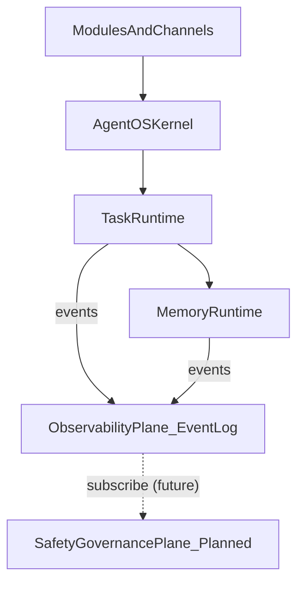
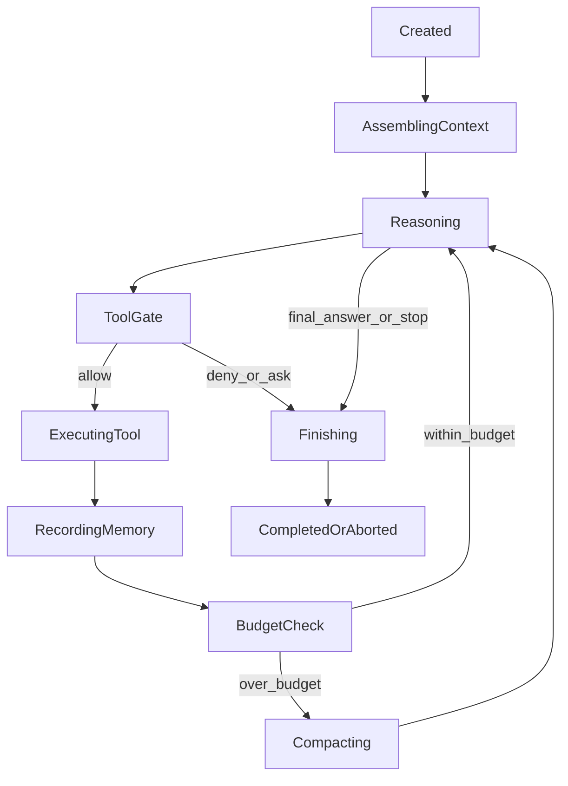
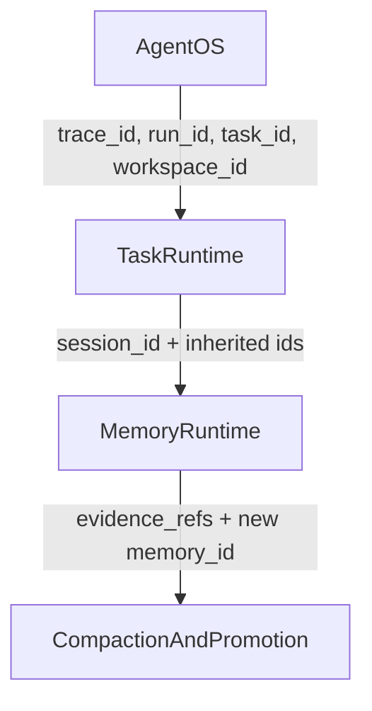
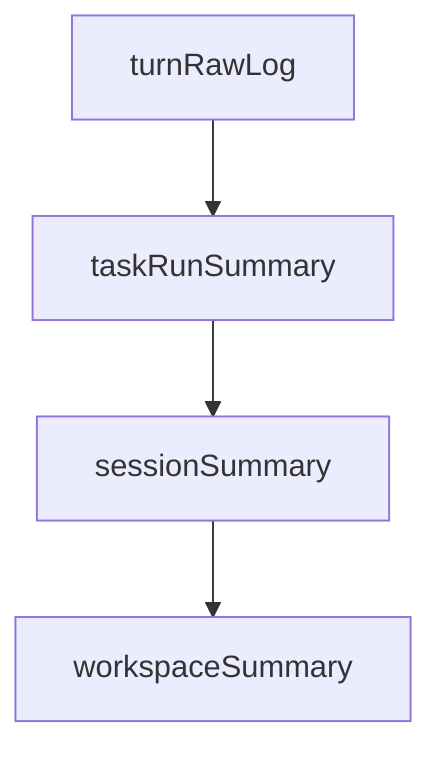
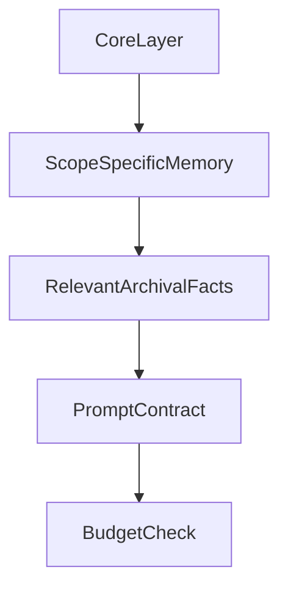

# Pulse MemoryRuntime 设计文档

> 定位：**Task Runtime + Memory Runtime 的合并设计文档**。
> 关联文档：`Pulse-AgentRuntime设计.md`、`Pulse-内核架构总览.md`、`Pulse-DomainMemory与Tool模式.md`。

---

## 0. 文档地图

> 文件名是历史命名（"MemoryRuntime"），实际内容同时覆盖 Task Runtime 与 Memory Runtime。

| 章节 | 所属层 |
|---|---|
| §1 设计目标 | 总论 |
| §2 三层运行时 | 总论 |
| §3 执行模式矩阵 | 总论 |
| §4 Task Runtime 状态机 | Task Runtime |
| §5 Hook / Gate / Recovery | Task Runtime(SafetyPlane 部分规划中) |
| §6 Prompt Contract 体系 | Task Runtime |
| §7 Layer × Scope 双轴记忆模型 | Memory Runtime |
| §8 Compaction / Promotion 管线 | Memory Runtime |
| §9 Context Assembly / Budget / Isolation | Task Runtime + Memory Runtime 交集 |

本文档**不**回答的内容（由 `Pulse-DomainMemory与Tool模式.md` 负责）：

- 业务域（job / mail / health 等）如何构建 facade
- Brain 如何通过 IntentSpec tool 写入 DomainMemory
- 用户主动陈述类偏好（"我不投大厂"）的路径

内核 Memory 与业务侧 DomainMemory 的**唯一接合点**是矩阵单元 **Workspace × workspace**（见 §7.4）。

---

## 1. 设计目标

Pulse 是一个**通用 AI 助手**，既支持用户实时交互，也支持长驻后台的周期任务、定时任务、子任务、断点恢复任务。因此内核不围绕某个业务场景构建，而围绕三个相互正交的问题：

1. Agent 如何长期运行并稳定触发任务
2. 单轮任务如何以工业化方式执行、恢复、压缩与终止
3. 记忆如何支撑执行，又不与调度、治理混层

### 1.1 设计原则

| 原则 | 说明 |
|------|------|
| **三层分离** | Agent OS ≠ Task Runtime ≠ Memory Runtime |
| **Layer × Scope 双轴** | 记忆既要回答"存在哪一层"，也要回答"属于哪个作用域" |
| **生命周期可插桩** | Hook 点必须明确，不能靠零散 if/else 维持系统复杂性 |
| **事实可追溯** | 长期记忆必须保留 evidence、版本链和 superseded 关系 |
| **业务与内核解耦** | 业务域通过 `Workspace × workspace` 单元接入，内核不感知业务语义 |

---

## 2. Pulse 三层运行时：Agent OS / Task Runtime / Memory Runtime

### 2.1 三层总体结构



> 2026-04 修订: `MemoryLayer.meta` 废弃, 审计/合规外移到独立的
> **Observability Plane**(事件流, 见 `Pulse-内核架构总览.md` §6).
> `SafetyPlane` 尚未实装, 架构位点保留, 未来以 EventLog 订阅者身份接入.

### 2.2 三层职责边界

| 层级 | 负责什么 | 不负责什么 |
|------|----------|------------|
| **Agent OS** | 长驻运行、调度、心跳、detached task、active hours、session policy、事件与熔断 | prompt 组装、事实晋升、最终答案生成 |
| **Task Runtime** | 单轮状态机、tool loop、hook、budget、stop reason、recovery | cron 调度、持久层 schema 细节 |
| **Memory Runtime** | operational / recall / workspace / archival / core 的读写、压缩、晋升、evidence tracing | 任务调度、业务路由、**审计落盘**(由 Observability Plane 负责) |

### 2.3 三层与 Memory 的读写关系

```
┌──────────────┐
│ Agent OS     │──── 读: workspace.summary (决定是否唤醒 task)
│              │──── 写: 心跳 / 事件日志 → recall
├──────────────┤
│ Task Runtime │──── 读: core.soul + recall.history + workspace.facts (组 prompt)
│ (Brain)      │──── 写: operational.scratchpad + recall.tool_calls
└──────────────┘      (读写都通过 MemoryEnvelope 统一接口)
        │
        ▼
┌────────────────┐
│ Memory Runtime │  真正拥有数据 + 决定怎么存 / 怎么压 / 怎么晋升
└────────────────┘
```

**所有 memory 都在 Memory Runtime 内**。Agent OS 与 Task Runtime 只是消费者/生产者，不持有数据。

### 2.4 层间契约

| 调用方向 | 契约 | 作用 | 实装 |
|----------|------|------|------|
| Agent OS → Task Runtime | `ExecutionRequest(mode, task_id, run_id, session_policy)` | OS 决定什么时候跑、以何种模式跑 | ✅ |
| Task Runtime → Memory Runtime | `MemoryEnvelope(layer, scope, trace_id, ...)` | 统一 envelope 读写记忆 | ✅ |
| 任意层 → Observability Plane | `(event_type, payload)` via `EventBus.publish` | 审计/合规/可观测, 见 `event_types.EventTypes` | ✅ |
| Task Runtime → SafetyPlane | `PolicyCheck(action, risk_level, source)` | 关键步骤进治理面 | ⏳ 规划中 |
| Memory Runtime → SafetyPlane | `PromotionRequest(from_layer, to_layer, evidence)` | 长期记忆晋升 | ⏳ 规划中 |

---

## 3. 执行模式矩阵

Pulse 的执行模式不是"同一套上下文 + 不同触发器"，而是**不同运行场景下完全不同的上下文、隔离、输出和记忆策略**。

### 3.1 五类执行模式

| 模式 | 触发源 | 典型场景 |
|------|--------|----------|
| `interactiveTurn` | 用户消息 / API / CLI | 用户主动问答、实时工具调用 |
| `heartbeatTurn` | Runtime 周期心跳 | 全局巡视：新消息、告警、待办、异常 |
| `detachedScheduledTask` | Runtime 定时调度 | 巡检、情报采集、定时同步 |
| `subagentTask` | 父任务派生 | 深度研究、并行探索、重型子任务 |
| `resumedTask` | 用户或系统恢复 | 断点续做 |

### 3.2 模式 × 维度矩阵

| 维度 | interactiveTurn | heartbeatTurn | detachedScheduledTask | subagentTask | resumedTask |
|------|-----------------|---------------|------------------------|--------------|-------------|
| **Session 策略** | 主会话 | `lightContext` 或隔离会话 | 隔离会话 | 隔离会话 | 恢复原 session |
| **Context 来源** | Core + Recall(recent) + Archival(relevant) | Core + workspace essentials | task brief + workspace facts + minimal recall | parent summary + task brief | checkpoint + compacted history |
| **Prompt Contract** | `systemPrompt` | `heartbeatPrompt` | `taskPrompt` | `taskPrompt`（scoped） | `recoveryPrompt` + `taskPrompt` |
| **输出目标** | 用户直出 | channel / none / event | event / storage / channel | 回传父任务 | 用户 / event |
| **Compaction 策略** | budget 驱动 | 每轮结束后轻量 compact | run 结束后 task compact | 结束后 compact + 汇报 | resume 前后 compact |
| **Promotion 策略** | recall → archival/core（视重要性） | workspace summary 更新 | task summary → workspace / archival | parent context + archival | 继承原任务策略 |
| **失败恢复** | retry / 告知用户 / degrade | skip / 下次重试 | degrade / circuit break / manual takeover | abort / 通知父任务 | checkpoint rollback |
| **预算等级** | 完整预算 | 轻量预算（约 20%） | 中等预算（约 40%） | 中等预算（约 40%） | 完整预算 |

---

## 4. Task Runtime 生命周期与状态机

### 4.1 Task Runtime 的职责

Task Runtime 负责**单轮 turn 或单个任务 continuation 的完整执行生命周期**。它回答的是"这一轮怎么跑"，而不是"什么时候跑"。

### 4.2 TaskContext 数据结构

```python
@dataclass
class TaskContext:
    trace_id: str
    run_id: str
    task_id: str
    session_id: str | None
    workspace_id: str | None
    mode: ExecutionMode
    prompt_contract: str
    isolation_level: str
    token_budget: int
    parent_task_id: str | None
    created_at: datetime
```

### 4.3 执行状态机



### 4.4 StopReason / Outcome 模型

| StopReason | 含义 |
|------------|------|
| `completed` | 正常完成 |
| `max_steps` | 达到最大推理步数 |
| `budget_exhausted` | token 预算不足 |
| `tool_blocked` | 关键工具被 gate 拒绝 |
| `user_cancelled` | 用户主动取消 |
| `error_aborted` | 连续错误导致中止 |
| `degraded` | 以降级模式完成 |
| `compacted` | 压缩后继续，不代表任务最终完成 |
| `parent_cancelled` | 子任务因父任务终止而结束 |

### 4.5 Tool-loop Contract

Task Runtime 中的 tool loop 必须满足以下契约：

1. 每轮工具调用前都要经过 `beforeToolUse` / Policy gate
2. 每轮工具结果都必须记录到 operational 或 recall 层
3. 每轮循环后都必须检查预算与 compact 触发条件
4. 每个 task run 都必须产生明确的 stop reason
5. 失败时必须明确走 retry / degrade / abort / rollback 中的哪条路径

### 4.6 ToolUseContract (推理 ↔ 动作一致性)

详见 [ADR-001-ToolUseContract](./adr/ADR-001-ToolUseContract.md) 与 `Pulse-内核架构总览.md` §7。三条正交契约:

| 契约 | 机制 | 实装 |
|---|---|---|
| A. Description | `ToolSpec.when_to_use / when_not_to_use` + PromptContract 三段式渲染 + 反例 few-shot | ✅ |
| B. Call | `LLMRouter.invoke_chat(tool_choice=...)` 按 ExecutionMode / 步数 / 上一轮是否纯文本 escalate | ⏳ 规划中 |
| C. Execution Verifier | 终回复前 LLM 自评 commitment vs used_tools, 不一致则改写为坦诚说明 | ⏳ 规划中 |

不变式: 语义判断归 LLM, 结构判断归 Python; 禁止在 host 侧用关键词 / 正则匹配用户意图强制调工具。

---

## 5. Hook / Gate / Recovery / Approval / Rollback 控制面

### 5.1 Hook / Interception Lifecycle

| Hook | 触发时机 | 只观测 | 可阻断 | 可注入上下文 | 负责审计/回放 |
|------|----------|--------|--------|--------------|----------------|
| `beforeTaskStart` | Task Runtime 启动前 | 是 | 是 | 是 | 是 |
| `beforeToolUse` | 工具调用前 | 是 | 是 | 是 | 是 |
| `afterToolUse` | 工具调用后 | 是 | 否 | 是 | 是 |
| `beforeCompact` | 压缩前 | 是 | 否 | 是 | 是 |
| `afterCompact` | 压缩后 | 是 | 否 | 是 | 是 |
| `beforePromotion` | 晋升前 | 是 | 是 | 否 | 是 |
| `afterPromotion` | 晋升后 | 是 | 否 | 否 | 是 |
| `onRecovery` | 恢复流程触发时 | 是 | 否 | 是 | 是 |
| `onCircuitOpen` | 熔断打开时 | 是 | 否 | 否 | 是 |
| `onTaskEnd` | 任务结束时 | 是 | 否 | 否 | 是 |

### 5.2 Safety Gate 梯度

| Level | 策略 | 典型场景 |
|------|------|----------|
| L0 | `allow` | 低风险只读操作 |
| L1 | `allow+log` | 常规工具调用 |
| L2 | `ask` | 首次外部 MCP、敏感数据读取 |
| L3 | `confirm` | 核心记忆修改、治理规则调整、高风险外部写操作 |
| L4 | `deny` | 黑名单关键词、越权工具调用 |
| L5 | `block+alert` | 可疑恶意行为、异常风暴、熔断触发 |

### 5.3 Recovery / Approval / Rollback 梯度

| 梯度 | 策略 | 适用情况 |
|------|------|----------|
| `retry` | 指数退避重试 | 瞬时网络错误、429 |
| `degrade` | 降级模型/工具/上下文 | 主模型不可用、外部服务不稳定 |
| `skip` | 跳过非关键步骤 | 可缺省流程失败 |
| `abort` | 中止当前 run | 关键步骤失败、连续错误 |
| `rollback` | 回滚已写入状态 | 错误记忆写入、错误治理变更 |
| `circuitBreak` | 停止整个定时任务族 | 同类任务连续失败 |
| `manualTakeover` | 人工接管 | 熔断后或高风险连续触发 |

---

## 6. Prompt Contract 体系

### 6.1 为什么不能只有一个 system prompt

不同执行模式下，Pulse 面对的任务性质不同：

- `interactiveTurn` 需要完整人格、工具、上下文与对话历史
- `heartbeatTurn` 需要轻量巡视，而不是完整历史重放
- `detachedScheduledTask` 更关注任务目标、边界与输出槽位
- `resumedTask` 需要 checkpoint 和 continuation contract

因此，Pulse 必须使用**Prompt Contract 体系**而不是单一 prompt。

### 6.2 六类 Prompt Contract

| Contract | 使用场景 | 核心内容 |
|----------|----------|----------|
| `systemPrompt` | `interactiveTurn` | 身份、原则、记忆、工具、边界 |
| `heartbeatPrompt` | `heartbeatTurn` | workspace essentials、巡视目标、禁止展开重型推理 |
| `taskPrompt` | `detachedScheduledTask` / `subagentTask` | 任务目标、成功条件、允许工具、输出目标 |
| `compactPrompt` | 压缩阶段 | 保留目标、已完成、待办、关键发现、用户纠正 |
| `promotionPrompt` | 晋升阶段 | 提取事实、偏好、规则、证据、冲突候选 |
| `recoveryPrompt` | `resumedTask` | checkpoint、已完成步骤、失败点、下一步 |

### 6.3 Prompt 组装顺序

以 `interactiveTurn` 为例：

1. Soul / Identity
2. User Profile / Preferences
3. Workspace Summary
4. Recent Recall
5. Relevant Archival Facts
6. Tool Menu
7. Safety Boundaries
8. Current Task / User Query

### 6.4 Prompt Contract 的治理要求

- 不同 contract 必须显式声明适用模式
- `compactPrompt` 与 `promotionPrompt` 属于"控制面 prompt"，不可与 user-facing prompt 混用

### 6.5 Tool Menu 渲染规范 (ToolUseContract 契约 A)

`Tool Menu` 节由 `PromptContractBuilder._section_tools` 按三段式渲染, 数据源是 `ToolRegistry.list_tools()` 返回的 `ToolSpec` 列表:

```
- `<tool.name>`: <description>
    when_to_use: <前置条件 / 副作用边界 / 何时属于本工具>
    when_not_to_use: <邻居工具职责划分 / 能力边界外>
```

`_section_tool_use_policy` 额外附带一组 few-shot 反例 (BAD: 无 tool_call 假装动作 vs GOOD: 真调 tool 再回复), 用于锚定「推理→动作」行为范式。`when_*` 字段只陈述**代码事实** (schema 约束 / API 副作用 / 与邻居工具的职责划分), 不列用户口语示例 (后者与 host 侧关键词守卫同构, 属反模式)。

---

## 7. Layer × Scope 双轴记忆模型

### 7.1 设计动机

单一"记忆层"会导致：

- `CoreMemory.context` 混入 task state、beliefs、scratchpad
- `RecallMemory` 里只有 `session_id`，缺少 task / run / workspace 维度
- 没有 operational memory 这种任务执行态临时层
- 没有 workspace summary / workspace facts 这种中间层

因此引入 **Layer × Scope 双轴模型**：Layer 回答"存在哪一层"，Scope 回答"属于哪个作用域"。

### 7.2 Layer 轴：记忆层次

| Layer | 生命周期 | 存储 | 检索路径 | 说明 |
|------|----------|------|----------|------|
| **Operational** | turn / run 内 | 内存 | 直接读 | 当前步骤、tool observation、checkpoint、open loops |
| **Recall** | 中期 | PostgreSQL | recent + agentic search (ILIKE) | 对话、工具调用、turn/task/session summary |
| **Workspace** | 中长期 | PostgreSQL | KV facts + summary 直接读 | workspace summary、活跃任务、模块状态快照 |
| **Archival** | 长期 | PostgreSQL | SPO 精确过滤 + agentic keyword | 结构化时序事实 |
| **Core** | 长期 | JSON / 配置 | block 直接读 | soul、user、prefs |
| **Meta** | 长期 | JSON / PostgreSQL | 直接读 | 审计、治理、行为分析、DPO，不直接作为用户检索上下文 |

### 7.3 Scope 轴：记忆归属

| Scope | 边界 | 典型内容 |
|------|------|----------|
| `turn` | 单次 LLM 推理循环 | 当前 thought / observation |
| `taskRun` | 单次 run | 任务目标、中间产物、run summary |
| `session` | 单次会话 | 对话历史、session summary |
| `workspace` | 单个工作区 / 模块空间 | workspace summary、workspace facts |
| `global` | 用户全局 | soul / prefs / 长期事实 |

### 7.4 Layer × Scope 交叉矩阵

| Layer \ Scope | turn | taskRun | session | workspace | global |
|---------------|------|---------|---------|-----------|--------|
| Operational | 当前步骤 | checkpoint | - | - | - |
| Recall | raw log | task summary | session summary | - | - |
| Workspace | - | - | - | **workspace summary + facts ★** | - |
| Archival | - | - | - | workspace facts | long-term facts |
| Core | - | - | - | - | soul / user / prefs |
| Meta | - | - | - | - | governance / audit / analysis |

> **★ Workspace × workspace 单元是业务侧 DomainMemory 的唯一接合点。**
>
> 业务域（job / mail / health 等）在该单元上构建领域 facade（`JobMemory` 等），Brain 通过 `IntentSpec` tool 读写，领域 LLM 调用点（matcher / replier / planner）消费。内核本层不感知业务语义，只提供通用 KV/summary CRUD 与 envelope 结构。
>
> 详见 `Pulse-DomainMemory与Tool模式.md`。

### 7.5 `core.context` 拆分原则

`CoreMemory.context` 不承担 task state / runtime scratchpad / mutable beliefs 的混合职责，拆分为：

- task state → `OperationalMemory`
- workspace summary → `WorkspaceMemory`
- mutable beliefs / governed rules → Core / Meta / Governance 流程

### 7.6 MemoryEnvelope 统一数据模型

```python
@dataclass
class MemoryEnvelope:
    memory_id: str
    kind: str
    layer: MemoryLayer
    scope: MemoryScope

    trace_id: str
    run_id: str
    task_id: str | None
    session_id: str | None
    workspace_id: str | None

    content: str | dict[str, Any]

    source: str
    status: str
    confidence: float
    evidence_refs: list[str]

    created_at: datetime
    updated_at: datetime
    valid_from: datetime | None
    valid_to: datetime | None
    superseded_by: str | None
```

### 7.7 关键 ID 传播规则



约束如下：

| ID | 生成位置 | 作用 |
|----|----------|------|
| `trace_id` | 单次执行入口 | 追踪全链路 |
| `run_id` | 每次 run 启动 | 区分同一 task 的多次运行 |
| `task_id` | 任务注册或派生时 | 聚合任务族 |
| `session_id` | 会话策略决定时 | 聚合交互历史 |
| `workspace_id` | 模块 / 工作区解析时 | 进行 workspace summary 和 workspace facts 汇总 |

---

## 8. Compaction Pipeline 与 Promotion Pipeline

### 8.1 四级 Compaction Pipeline



### 8.2 Compaction 规则

| 路径 | 触发条件 | 输入 | 输出 |
|------|----------|------|------|
| turn → taskRun | 每轮推理结束 | raw tool calls / observations | running task summary |
| taskRun → session | run 完成或中止 | task summary + outcome | session summary |
| session → workspace | 会话结束 / budget 压缩 | session summary | workspace summary |
| workspace → workspace | 周期任务 | 多个 session summaries | 重写 workspace summary |

### 8.3 Promotion Pipeline

| 晋升路径 | 触发条件 | 审批要求 | 说明 |
|----------|----------|----------|------|
| Recall → Archival | 检测到稳定事实 | `beforePromotion` + 冲突检测 | 形成结构化事实 |
| Recall → Core | 检测到偏好 / 身份变更 | `beforePromotion` + Governance 审批 | 更新 user/prefs |
| Workspace → Archival | workspace summary 中出现稳定事实 | 低风险自动 / 中高风险审批 | 形成 workspace facts |

> **Promotion Pipeline 只处理"机器从对话/任务中 LLM 提取的稳定事实"，不处理"用户主动陈述的偏好"。**
>
> 后者（如"我不投大厂"、"屏蔽拼多多"）由 Brain 通过 `<domain>.<intent>` tool_use 直接写入 DomainMemory facade，不走本 pipeline。两条路径并存且不冲突：
>
> - **Promotion pipeline**：隐式 / 自动 / LLM 提取 → Archival 或 Core
> - **DomainMemory tool_use**：显式 / 用户语义触发 / 直接写 Workspace × workspace
>
> 详见 `Pulse-DomainMemory与Tool模式.md`。

### 8.4 Promotion 流程

1. Detection：LLM 或规则提取候选项
2. Validation：检查冲突、时效、evidence 充分性
3. Approval：低风险自动，中高风险经 Governance（SafetyPlane 实装后接入）
4. Write：写入目标层，保留 `evidence_refs`（记忆侧版本链, §8.5）
5. Supersede：若是更新事实，旧记录标记 `superseded_by`
6. Audit：发射 `memory.promoted` / `memory.superseded` 事件到 Observability Plane(`JsonlEventSink` append-only 落盘), 不再写 `MemoryLayer.meta`

### 8.5 时序事实模型

长期事实不是覆盖写、不是追加写，而是带版本链的结构化记录：

| 字段 | 作用 |
|------|------|
| `valid_from` / `valid_to` | 时效窗口 |
| `superseded_by` | 指向替代该事实的新版本 |
| `evidence_refs` | 指向产生该事实的 recall / tool_call 证据 |
| `confidence` | 置信度（由提取流程计算） |

在此模型下，"用户从杭州搬到上海" 表达为新事实插入 + 旧事实被 `superseded_by` 指向，而非原地修改；所有长期记忆的修改都可回放、可审计。

> **字段语义边界**:
> - `valid_from / valid_to / superseded_by / evidence_refs / confidence` 是**记忆侧**的版本链元数据, 服务于"给 LLM 读"的正确性(选最新有效版本).
> - **系统级审计**(谁在什么时候用哪个模型产生了这次 supersede) 走 Observability Plane 的 `memory.superseded` / `memory.promoted` 事件, 两套机制**互补**(不是二选一).
> - `causation_id`(事件因果链) 与 `evidence_refs`(记忆证据链) 是不同维度的可追溯性, 前者串事件时序, 后者串事实来源.

---

## 9. Context Assembly、Token Budget 与 Session Isolation

### 9.1 Context Assembly



装配原则：

- **先 Core，后 Scope，最后 Archival**
- `heartbeatTurn` 只读 workspace essentials，不重放完整历史
- `detachedScheduledTask` 只加载 task brief、workspace facts 和必要约束
- `subagentTask` 继承父任务摘要，而不是整个父会话
- `resumedTask` 使用 checkpoint + compacted history，而不是完全原始 transcript

### 9.2 Token Budget 策略

| 预算区间 | 策略 |
|----------|------|
| < 60% | 正常装配 |
| 60% ~ 80% | 精简 recall 和 archival |
| 80% ~ 95% | 触发 session/task compaction |
| > 95% | 进入降级模式，只保留 core + task brief + minimal contract |

### 9.3 Session Isolation 策略

| 隔离级别 | 上下文范围 | 适用模式 | 成本 |
|----------|-----------|----------|------|
| `mainSession` | 主会话完整上下文 | `interactiveTurn`、`resumedTask` | 高 |
| `lightContext` | Core + workspace essentials | `heartbeatTurn` | 低 |
| `isolatedSession` | Core + task brief + 空 recall | `detachedScheduledTask`、`subagentTask` | 最低 |

### 9.4 Compaction 后必须回注的信息

| 信息 | 原因 |
|------|------|
| `task_objective` | 否则任务目标漂移 |
| `pending_actions` | 否则 continuation 丢失 |
| `key_decisions` | 否则后续步骤缺少上下文依据 |
| `user_corrections` | 否则会重犯已纠正错误 |
| `active_tool_state` | 否则运行中的工具链会断裂 |

---

## 附录 A：术语表

| 术语 | 定义 |
|------|------|
| Agent OS | Pulse 的长驻运行内核 |
| Task Runtime | Pulse 的单轮执行引擎 |
| Memory Runtime | Pulse 的记忆读写、压缩、晋升子系统(五层: operational/recall/workspace/archival/core) |
| TaskContext | 单次执行上下文 |
| MemoryEnvelope | 统一记忆信封 |
| Compaction | 高容量上下文压缩为低容量摘要 |
| Promotion | 中短期记忆晋升为长期记忆 |
| Observability Plane | 事件总线 + InMemoryEventStore + JsonlEventSink, 承担审计/合规/可观测职责(见 `Pulse-内核架构总览.md` §6) |
| SafetyPlane | 治理控制面(policy gate / approval / rollback), ⏳ 规划中, 未来以 Observability Plane 订阅者身份接入 |

## 附录 B：检索策略（Agentic Search）

本附录定义 Pulse 内核的检索架构：**所有语义判断交给 LLM，内核只提供结构化存储与关键词匹配**。对应 §7.2 表格"检索路径"列。

### B.1 架构

```mermaid
flowchart LR
  Brain[Brain / DomainLLM] -->|keywords[]| Kernel[Memory Runtime]
  Kernel -->|ILIKE| PG[(PostgreSQL)]
  PG -->|rows| Kernel
  Kernel -->|ordered by created_at DESC| Brain
  Brain -->|rerank / 语义判断| Brain
```

**分层职责**

| 层 | 负责 | 不负责 |
|---|---|---|
| Brain / DomainLLM | 关键词扩展（同义词、中英对照、缩写）、结果 rerank、语义相关性判断 | 直接访问存储 |
| Memory Runtime | 关键词 ILIKE + scope 过滤 + `created_at DESC` 排序 + `top_k` 截断 | 语义理解、embedding、相似度打分 |
| PostgreSQL | 唯一持久层，所有 Recall / Archival / Intel / Workspace 行 | 向量索引、ANN |

### B.2 第一性原理：为什么不引入向量 DB

| 维度 | 分析 | 结论 |
|---|---|---|
| **数据规模** | 单用户 conversations ~10²–10³/天；archival facts 半年累计 ≤ 10⁴；Intel 片段同量级 | 10⁴–10⁵ 行 PG 全表 ILIKE 的 P95 < 10 ms，向量索引无增益 |
| **语义能力归属** | LLM 本身已经是最强的语义理解器；embedding 相似度是**退化**的语义近似 | 语义判断交给 LLM，内核只需"能找到候选"即可 |
| **写入路径成本** | 每次写入触发一次 embedding 推理（网络 + token）；本地 deterministic embedding 质量退化到无用 | 向量写入既贵又差 |
| **故障域** | `chromadb` 自带 `onnxruntime` / `tokenizers` / `huggingface-hub` 数百 MB 依赖与 ABI 风险 | 内核必须最小依赖，不能因检索层拖垮启动 |
| **架构可逆性** | 写入走 `MemoryEnvelope` 统一信封；未来接入向量 = 新增 `SemanticRetriever` 读取同一张表 | 当前移除向量**不锁死**未来接入，单向可逆 |

**适用性边界**：向量召回仍是正确选择的场景是

- 海量非结构化语料（邮件全文、视频字幕、截屏归档），用户无法用关键词命中；
- 离线批处理、需要 ANN 的高 QPS 检索系统。

Pulse 不属于上述任一场景。

### B.3 接口契约

```text
RecallMemory.recent(session_id, task_id, workspace_id, role, limit)
RecallMemory.search_keyword(keywords, match="any|all", session_id?, workspace_id?, role?, top_k)

ArchivalMemory.recent(limit)
ArchivalMemory.query(subject?, predicate?, keyword?, limit)
ArchivalMemory.search_keyword(keywords, match="any|all", subject?, predicate?, top_k)

IntelKnowledgeStore.recent(category?, limit)
IntelKnowledgeStore.search(query | keywords, category?, match="any|all", top_k)
```

**不变式**

- 关键词扩展是调用方职责，内核不做改写；
- 不返回 similarity 分数，排序固定为 `created_at DESC`；
- 语义相关性由调用方（LLM）rerank 决定；
- 所有检索路径都遵循 §10.3 `IsolationLevel` 过滤。

### B.4 重新引入向量的触发条件

只要满足以下任一条件，重新评估引入向量层（优先 `pgvector`，而非独立服务）：

1. 单 workspace `conversations` > 5×10⁵ 行，且 PG 关键词检索 P95 > 200 ms；
2. 出现"用户描述与历史用词差异巨大导致关键词召回率显著下降"的真实 case ≥ 5 起；
3. 新增长文档跨库检索模块（全网邮件、视频字幕、跨年度技术文档）。

**所有触发判断以运行时指标为准，不在无数据时提前决策。**

---

## 附录 C：关联文档

| 文档 | 定位 |
|------|------|
| `Pulse-AgentRuntime设计.md` | Agent OS 基线设计 |
| `Pulse-内核架构总览.md` | 内核层次与契约的顶层索引 |
| `Pulse-DomainMemory与Tool模式.md` | 业务侧 DomainMemory facade 与 IntentSpec tool 规范 |
| `Pulse架构方案.md` | 全局架构设计（含 ChromaDB 章节为历史草案，不再代表当前内核形态，统一以本文档为准） |
