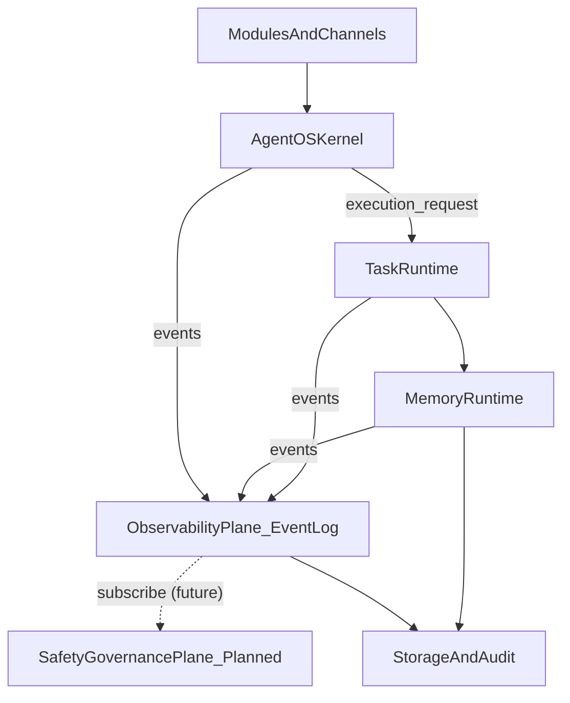
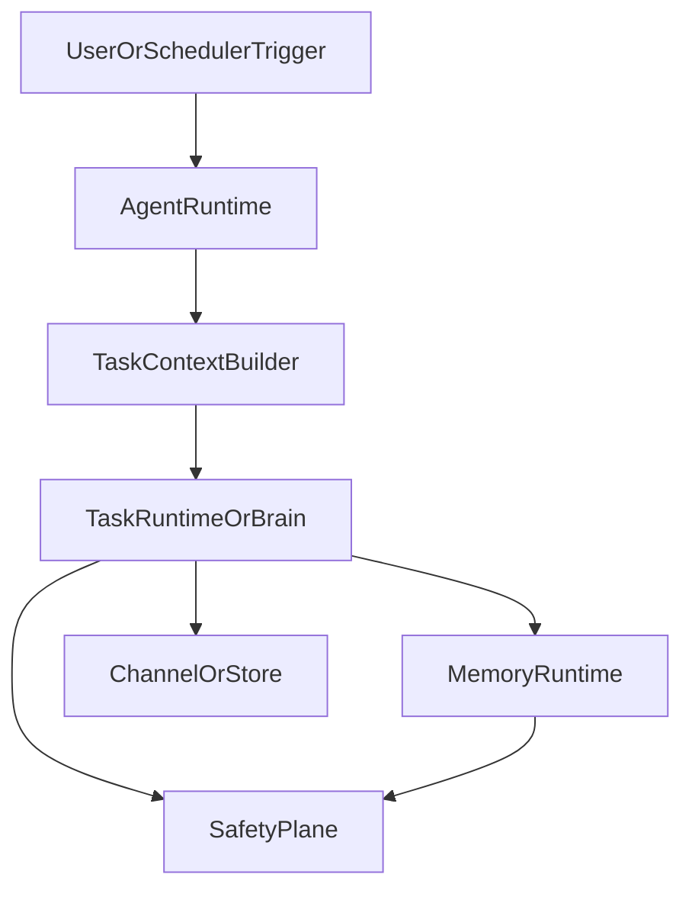
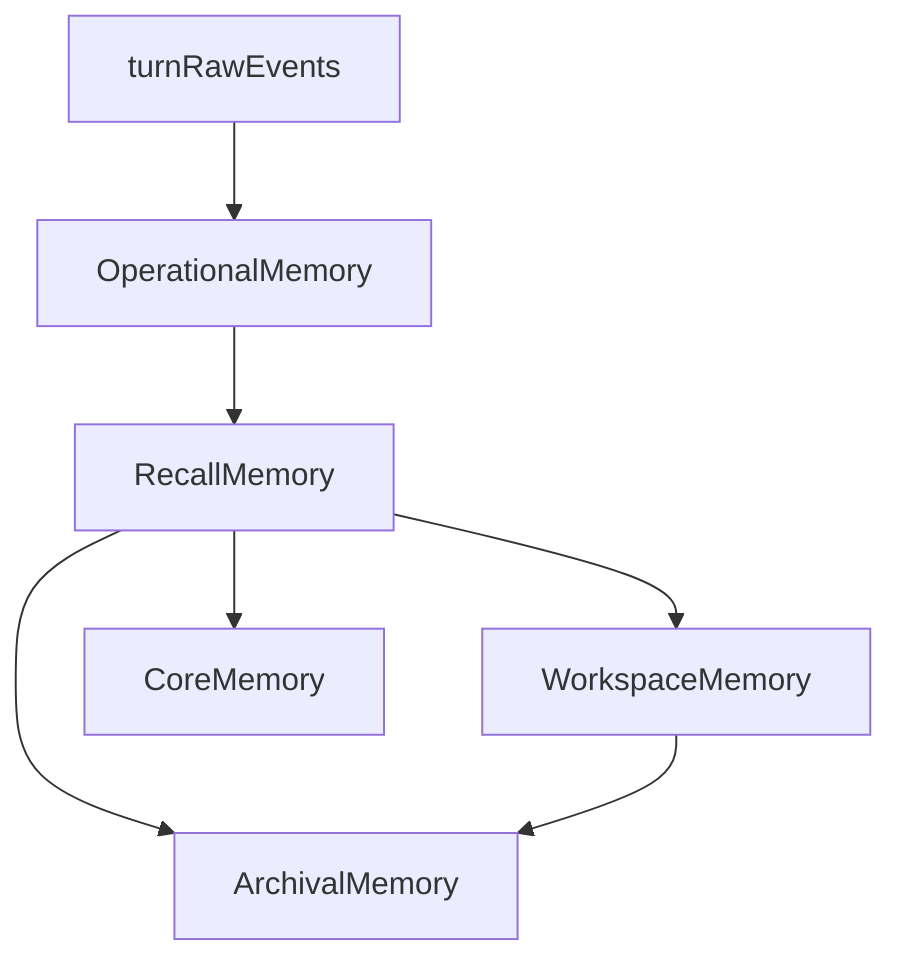
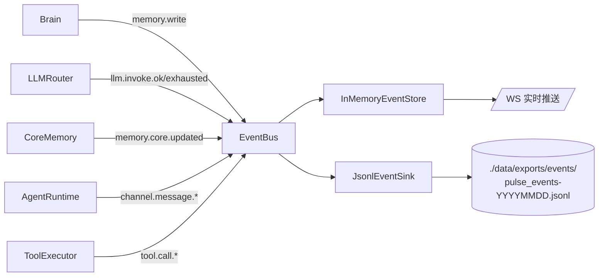

# Pulse 内核架构总览

> 定位：Pulse 内核的层次、数据流与关键契约的**架构索引**。
> 关联文档：`Pulse-AgentRuntime设计.md`、`Pulse-MemoryRuntime设计.md`、`Pulse-DomainMemory与Tool模式.md`

---

## 1. 文档定位

本文档只回答三件事：

1. Pulse 内核由哪几层构成、各自职责边界在哪
2. 执行链路、记忆链路、观测/审计链路如何流动
3. 层与层之间以什么契约交互（`ExecutionRequest` / `MemoryEnvelope` / `Event` / `PolicyCheck` / `PromotionRequest`）

> **2026-04 架构修订**:
> - **`MemoryLayer.meta` 废弃**, 审计职责外移到独立的 **Observability Plane**(事件流)
> - **`SafetyPlane` 尚未实装**, 架构位点保留, 未来以 EventLog 订阅者身份接入
> - 新增 **EventBus + InMemoryEventStore + JsonlEventSink** 三件套, 见 §6

---

## 2. 内核五层



### 2.1 五层职责边界

| 层级 | 核心职责 | 严禁混入的职责 | 实装状态 |
|------|----------|----------------|----------|
| **Agent OS** | 长驻运行、调度、active hours、熔断、事件广播、运行状态 | prompt 组装、事实晋升、用户偏好写入 | ✅ |
| **Task Runtime** | 单轮执行状态机、tool loop、hook、budget、stop reason、恢复梯度、ToolUseContract (见 §7) | cron 调度、长期事实 schema 细节 | ✅ (契约 A 落地, B/C 规划中) |
| **Memory Runtime** | 五层记忆读写(见 §2.2)、压缩、晋升、evidence tracing | 任务调度、最终答案生成、审计落盘 | ✅ |
| **Observability Plane** | 事件总线 + append-only 审计落盘 + 订阅推送 | 不存业务数据、不做决策 | ✅ |
| **SafetyPlane** | policy gate、approval、rollback、manual takeover | 主动业务执行 | ⏳ 规划中(订阅 Observability Plane) |

### 2.2 层与 Memory 的读写关系

```
┌──────────────────────────────────────────┐
│ Agent OS                                 │
│   读: workspace.summary (决定是否唤醒)   │
│   写: 心跳 → recall; 事件 → EventBus     │
├──────────────────────────────────────────┤
│ Task Runtime (Brain)                     │
│   读: core.soul + recall.history         │
│        + workspace.facts (组 prompt)     │
│   写: operational.scratchpad             │
│        + recall.tool_calls               │
│   事件: memory.write / llm.invoke 等 →   │
│         EventBus → JsonlEventSink        │
│   触发: compaction / promotion           │
├──────────────────────────────────────────┤
│ SafetyPlane (规划中)                     │
│   订阅: EventBus (policy.*/memory.*)     │
│   产出: PolicyDecision 事件              │
└──────────────────────────────────────────┘
              │                      │
              ▼ MemoryEnvelope       ▼ Event(type, payload)
┌──────────────────────────┐  ┌────────────────────────┐
│ Memory Runtime           │  │ Observability Plane    │
│  (给 LLM 读的数据源)     │  │  (给人/合规读的事件流) │
│  operational / recall /  │  │  EventBus + InMemory + │
│  workspace / archival /  │  │  JsonlEventSink(日滚动)│
│  core                    │  │                        │
└──────────────────────────┘  └────────────────────────┘
```

**要点**:
- Memory Runtime 只负责"**下一轮推理要读什么**"(认知), **不**承担审计
- Observability Plane 只负责"**系统发生过什么**"(事件), 不承担"给 LLM 读"
- 两者**写入接口不同**: 前者 `MemoryEnvelope`, 后者 `event_bus.publish(type, payload)`
- 同一条业务行为(如 core 更新), 会**同时**在 Memory Runtime 落成新状态 + 在 Observability Plane 落成一条 `memory.core.updated` 事件

---

## 3. 文档分工

| 文档 | 定位 |
|------|------|
| `Pulse-AgentRuntime设计.md` | Agent OS：长驻运行、调度、心跳、active hours |
| `Pulse-MemoryRuntime设计.md` | Task Runtime + Memory Runtime：执行状态机、Prompt Contract、Hook、Layer×Scope、Compaction、Promotion |
| `Pulse-DomainMemory与Tool模式.md` | 业务侧应用规范：DomainMemory facade、IntentSpec tool、Brain 接入 |
| `Pulse-内核架构总览.md` | 本文档：内核层次与契约的顶层索引 |

---

## 4. 核心数据流

### 4.1 执行链路



### 4.2 记忆链路



> 注: 历史架构中的 `Meta` 节点已移出记忆层, 改为 Observability Plane 的独立事件流(§6).

### 4.3 观测/审计链路



- `EventBus` 是内存 pub/sub, 两个默认订阅者:
  - `InMemoryEventStore` (滑动窗口, 2000 条, 供 WS/SSE 和 `/observability/events` API)
  - `JsonlEventSink` (append-only, 按天滚动, 供合规/复盘; 仅持久化 `llm./tool./memory./policy./promotion.` 前缀)
- 未来若接 OTel/Kafka, 只需新增一个 sink, **不动业务代码**

---

## 5. 关键 ID 与层间契约

### 5.1 ID 传播

| ID | 生成位置 | 传播范围 | 作用 |
|----|----------|----------|------|
| `trace_id` | Agent OS / Task Runtime 入口 | 全链路 | 关联一次完整执行 |
| `run_id` | 每次 run 启动 | Task Runtime → Memory Runtime | 区分同一 task 的多次执行 |
| `task_id` | patrol / detached / subagent 注册时 | Agent OS → Task Runtime → Memory Runtime | 聚合任务族 |
| `session_id` | session policy 决策时 | Task Runtime → Recall Memory | 聚合交互历史 |
| `workspace_id` | 模块 / 工作区解析时 | 全链路 | 聚合 workspace summary / facts |

### 5.2 层间契约

| 调用方向 | 契约 | 作用 | 实装 |
|----------|------|------|------|
| Agent OS → Task Runtime | `ExecutionRequest(mode, task_id, run_id, session_policy)` | 决定什么时候跑、以何种模式跑 | ✅ |
| Task Runtime → Memory Runtime | `MemoryEnvelope(layer, scope, trace_id, ...)` | 以统一 envelope 读写记忆 | ✅ |
| Task Runtime → PromptContract | `ToolSpec.when_to_use / when_not_to_use` 经三段式渲染注入 system prompt | ToolUseContract 契约 A (§7) | ✅ |
| Task Runtime → LLMRouter | `invoke_chat(tools, tool_choice=...)` | ToolUseContract 契约 B (§7) | ⏳ 规划中 |
| Task Runtime 内部 | `CommitmentVerifier.verify(reply, used_tools, ...)` | ToolUseContract 契约 C (§7) | ⏳ 规划中 |
| 任意层 → Observability Plane | `(event_type, payload)` via `EventBus.publish` | 审计/合规/可观测, 见 `event_types.EventTypes` | ✅ |
| Task Runtime → SafetyPlane | `PolicyCheck(action, risk_level, source)` | 关键步骤入治理面 | ⏳ 规划中 |
| Memory Runtime → SafetyPlane | `PromotionRequest(from_layer, to_layer, evidence)` | 长期记忆晋升审批 | ⏳ 规划中 |
| Brain → Agent OS | `PatrolLifecycleRequest(name, action ∈ {list, status, enable, disable, trigger})` | 对话式 per-patrol 控制面;通过 `system.patrol.*` IntentSpec → `AgentRuntime.{list/get_stats/enable/disable/run_once}_patrol`;事件 `runtime.patrol.lifecycle.*`(ADR-004 §6.1) | ✅ |

详见 `Pulse-MemoryRuntime设计.md` §3.3 / §8.6 / §8.7 和 §6(本文档) Observability Plane。

---

## 6. Observability Plane(事件流)

### 6.1 为什么独立出来

记忆和审计是**两个读者不同的系统**:

| 维度 | Memory Runtime | Observability Plane |
|------|---------------|---------------------|
| 读者 | LLM(下一轮推理) | 人 / 合规 / 治理 / 监控 |
| 可变性 | 允许压缩、覆盖、淘汰 | **不可变** append-only |
| 语义分层 | operational/recall/workspace/archival/core | 按事件类型(`llm./tool./memory./policy./*`) |
| 容量 | 受限, 需要压缩/摘要 | 按天滚动, 长期保留 |
| SLA | 读延迟敏感(挡在 LLM 前) | 写耐久性优先, 读可异步 |

把审计塞进 `MemoryLayer.meta` 会让 Memory Runtime **同时背两套语义**, 既违反单一职责, 又导致 envelope 里的 `evidence_refs / superseded_by / promoted_from` 这些审计字段没有合适的表 schema 可存(历史实装里它们被 JSON-dump 进 `conversations.metadata_json` 大字段, 丢失了 append-only 和可查询性)。

### 6.2 架构一图流

```
                             ┌─────────────────────┐
             Brain     ─────►│                     │
             LLMRouter ─────►│     EventBus        │ 内存 pub/sub
             CoreMemory ────►│  (in-process)       │ 非阻塞、同步回调
             AgentRuntime ──►│                     │
             ToolExecutor ──►│  (⏳ 待直接接入)    │
             BossConnector ─►│  (⏳ 待迁移)        │
                             └──────────┬──────────┘
                                        │ subscribe_all
            ┌───────────────────────────┼───────────────────────────┐
            ▼                           ▼                           ▼
  ┌──────────────────┐         ┌──────────────────┐         ┌──────────────┐
  │ InMemoryEvent    │         │ JsonlEventSink   │         │ Metrics / OTel│
  │ Store            │         │ (append-only)    │         │  ⏳ 规划中    │
  │ 滑动窗口 2000 条 │         │ 按天滚动 JSONL   │         │ (新增一个     │
  │ 供 WS/SSE 推送   │         │ llm./memory./    │         │  sink 即可)   │
  │ 和 /observability│         │ policy./promotion│         │               │
  │  API            │         │ 前缀才持久化     │         │               │
  └──────────────────┘         └──────────────────┘         └──────────────┘

                    ═══════════ 与记忆运行时的关系 ═══════════

  一次业务行为(例 CoreMemory.update_block) 会**同时**发生:
    ① 写入记忆存储 (core_memory.json) ────► 给 LLM 下一轮读
    ② 发射 memory.core.updated 事件   ────► 给人/合规/未来的 SafetyPlane 读
  两条路**并行写**, 不是"事件流 → 重建状态"的 event sourcing.
  MemoryRuntime 是独立数据源, 不是 EventLog 的物化视图.
```

**图例**: ✅ 已实装 / ⏳ 规划中

这张图回答三件事:
1. **谁往事件总线写**: 当前是 `Brain / LLMRouter / CoreMemory / AgentRuntime`; `ToolExecutor / BossConnector` 暂时各自写独立日志, 后续迁移.
2. **谁从事件总线读**: `InMemoryEventStore`(内存) + `JsonlEventSink`(落盘); 未来加 Metrics/OTel sink 不动发射侧.
3. **和 MemoryRuntime 的关系**: **双写, 不是重建** — 避免被 event sourcing 带偏理解.

### 6.3 组件

- **`core/event_types.py`**: `EventTypes` 字符串 catalog + `make_payload(...)` 构造助手 + `should_persist()` 过滤器
- **`core/events.py`**: `EventBus` (pub/sub, 同步回调) + `InMemoryEventStore` (有界滑动窗口)
- **`core/event_sinks.py`**: `JsonlEventSink` (按天滚动 append-only, 只持久化审计前缀事件)

### 6.4 标准事件类型

当前 catalog(`core/event_types.py`) 只登记**有 Owner 的事件**, 分为三类:

| 事件前缀 | 发射者 | 事件常量 | 持久化 | 实装 |
|---------|--------|----------|--------|------|
| `channel.*` | `server.py` 通道派发 | `channel.message.received / .dispatched / .completed / .failed` | ❌ (量大, 从 logs 还原) | ✅ |
| `brain.*` | `server.py` ReAct 观察 | `brain.step / brain.tool.invoked` | ❌ (量大, 从 logs 还原) | ✅ |
| `llm.*` | `LLMRouter` | `llm.invoke.ok / llm.invoke.exhausted` | ✅ | ✅ |
| `memory.write` | `Brain._route_envelope` | 每次 envelope 成功写入 | ✅ | ✅ |
| `memory.core.updated` | `CoreMemory.update_block` | 仅在 hash 变化时发射(带 before/after hash) | ✅ | ✅ |
| `memory.promoted / .superseded` | `PromotionEngine` / archival 版本链 | 规划中, catalog 预留 | ✅ | ⏳ |
| `policy.* / promotion.request` | 未来的 SafetyPlane | 规划中, catalog 预留 | ✅ | ⏳ |

**ToolUseContract 事件扩展 (ADR-001)**:

| 事件 / payload 字段 | 发射点 | 含义 | 审计用途 |
|---|---|---|---|
| `llm.invoke.ok.tool_choice_applied` | `LLMRouter.invoke_chat` (契约 B Phase 1a) | 本次调用下发的 `tool_choice` 值 (`"auto"` / `"required"` / dict); 字段缺失 = 调用方未指定 | 回答"Brain 在哪几步真的强制 required" |
| `*.trigger.started.scan_handle` | `JobGreetService.run_trigger` (契约 B Phase 2) | LLM 传进来的 scan_handle 字符串; 缺失表示 LLM 没走 hand-off | 测量 hand-off 生效率 |
| `*.trigger.started.scan_handle_reused` | 同上 | `true` = 缓存命中跳过重扫; `false` = legacy fallback 或未传 handle | 回答"是否消除了 scan→trigger 双扫" |
| `*.scan.completed.scan_handle` | `JobGreetService.run_scan` | 本次 scan 发出去的 handle | 与 `trigger.started.scan_handle` 配对即可还原链路 |
| `brain.commitment.verified` | `Brain._verify_commitment` (契约 C) | reply 通过 commitment 审核 (无承诺 / 承诺已兑现 / negative commitment); payload 带 `has_commitment` + `used_tools_count` | 做"本轮 contract C 是否放行"断言, 统计 unfulfilled 率的分母 |
| `brain.commitment.unfulfilled` | 同上 | reply 声明了动作承诺但 `used_tools` 未兑现, 已用 judge LLM 改写为坦诚说明; payload 带 `commitment_excerpt` + `reason` + `rewritten_reply_preview` | 复盘"agent 撒谎"事件, 对应 ADR-001 §1 trace_e48a6be0c90e 类问题 |
| `brain.commitment.degraded` | 同上 | verifier 自身失败 (LLM 错误 / JSON 不合规 / 契约违反); fail-OPEN 返回原 reply; payload 带 `error_message` | 监控 judge LLM 稳定性, 超 1% 触发 ADR-001 §5.2 重评 |

> **持久化规则**(`should_persist`): 仅前缀属于 `llm./memory./policy./promotion.` 的事件才写入 `JsonlEventSink`; `channel.*` / `brain.*` 高频事件只进 `InMemoryEventStore` 的滑动窗口, 从 `logs/*.log` 可还原.

### 6.5 因果链(causation_id)

`MemoryEnvelope` 的 `evidence_refs / promoted_from / superseded_by` 三个字段的**语义**在事件流里通过 `payload.causation_id` 实现:

- 旧: envelope A 在 content 里带 `evidence_refs=[B.memory_id]`, 下游靠 JSON metadata 查
- 新: 发射事件时, `payload.causation_id = 触发事件的 event_id`, 所有事件都在同一 JSONL 里按时间序排列, `jq 'select(.causation_id=="evt_xxx")'` 即可回放因果链

### 6.6 装配点

见 `core/server.py`:

```
event_bus = EventBus()
event_store = InMemoryEventStore(...)
event_bus.subscribe_all(event_store.record)          # WS/SSE 推送
event_bus.subscribe_all(JsonlEventSink(...).handle)  # 审计落盘
core_memory.bind_event_emitter(event_bus.publish)    # 让 CoreMemory 发事件
llm_router.bind_event_emitter(event_bus.publish)     # 让 LLMRouter 发事件
brain.bind_event_emitter(event_bus.publish)          # 让 Brain 发 memory.write / brain.commitment.*
commitment_verifier = CommitmentVerifier(llm_router=llm_router)
brain = Brain(..., commitment_verifier=commitment_verifier)  # 契约 C 装配点
```

### 6.7 未来演进

- 当 `SafetyPlane` 实装, 它只需 `event_bus.subscribe("memory.promoted", ...)` / `event_bus.subscribe("llm.invoke.ok", ...)`, **无需修改发射侧**
- 当要接入 Kafka/OTel, 只需新增一个 sink(``KafkaEventSink`` 实现相同 `handle(event_type, payload)` 签名), **无需修改发射侧**
- `boss_connector_audit.jsonl` 是 JsonlEventSink 的一个**特化物化视图**, 后续会统一到同一套 `connector.*` 事件

---

## 7. ToolUseContract (工具使用合约)

详细决策与第一性原理分析见 [ADR-001-ToolUseContract](./adr/ADR-001-ToolUseContract.md)。

Task Runtime 内「LLM 推理输出 → 真实动作」这一跳由三条正交契约共同守护, 任一失守由次级契约补位, 禁止在任一层用内容关键词判断意图。

### 7.1 三契约职责

| 契约 | 负责 | 不负责 | 实装 |
|---|---|---|---|
| A. DescriptionContract | `ToolSpec.when_to_use / when_not_to_use` + PromptContract 三段式渲染 + 反例 few-shot | 选哪个工具; 参数取值 | ✅ |
| B. CallContract Phase 1a | `LLMRouter.invoke_chat` 透传 `tool_choice` + `llm.invoke.ok.tool_choice_applied` 审计字段 | — | ✅ |
| B. CallContract Phase 1b | 按 `ExecutionMode` 与 ReAct 步数决定 `tool_choice=auto \| required`; 纯文本空 tool 轮后一次性 escalate (**包括 interactive**) | 工具参数内容 | ✅ |
| B. CallContract Phase 2 | 工具间 hand-off — `*_handle` 复用上游结果, miss 走 fail-loud 而非静默重算 (首发 `scan_handle`) | 单工具内部的调用决策 | ✅ |
| C. ExecutionVerifier | 终回复前 LLM 自评 `commitment vs used_tools` 一致性; 不一致改写为坦诚说明 + 发 `brain.commitment.unfulfilled` 落盘审计; 自身失败 fail-OPEN | 重试推理 (归 B); 工具返回值业务正确性 | ✅ |

### 7.2 契约 A 接口

```text
ToolSpec(
  name, description,
  when_to_use: str,       # 前置条件 / 副作用边界 / 何时属于本工具
  when_not_to_use: str,   # 职责划分到邻居工具 / 能力边界外
  ring, schema, metadata,
)
```

PromptContract `_section_tools` 渲染为「名字 + description + when_to_use + when_not_to_use」三段卡片; `_section_tool_use_policy` 追加一组「假装动作 vs 真调 tool」反例 few-shot。`IntentSpec` 透传 `when_*` 字段到 `as_tools()` 导出的 tool descriptor, 经 `tool_registry.register(...)` 写入 `ToolSpec`。

### 7.3 不变式

- `when_to_use` / `when_not_to_use` 只陈述**代码事实** (schema 约束 / 副作用边界 / 与邻居工具的职责划分), 不列用户口语示例
- 留空等价「未声明」, 渲染器退化为仅 `description`
- Host 侧**禁止**用关键词 / 正则判断用户意图以强制调工具 (反模式, 语义判断归 LLM)
