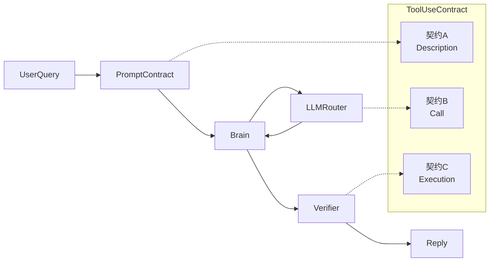

# ADR-001: ToolUseContract — 工具使用合约

| 字段 | 值 |
|---|---|
| 状态 | Accepted |
| 日期 | 2026-04-21 |
| 作用域 | Task Runtime / Brain / LLMRouter / PromptContract |
| 关联 | `Pulse-内核架构总览.md` §2.1、`Pulse-MemoryRuntime设计.md` §4/§6、`Pulse架构方案.md` §5.2/§5.3 |

---

## 1. 现状

Brain ReAct 循环中「LLM 推理输出 → 真实动作」这一跳没有可验证契约。防止「只说不做」幻觉只依赖 `PromptContractBuilder._section_tool_use_policy` 的自然语言约束，在 trace `9cc25f13` 等多次观察到失守。

**契约 B Phase 1 落地后，trace `e48a6be0c90e` 暴露了第二次失守**：interactive_turn 模式下（IM 对话），LLM 对"拼多多别投 + 学历过滤"这类**明确偏好指令**回复"已记录以下信息..."，但实际 `used_tools=[]`——`job.memory.record` 没被调用，承诺是**纯幻觉**。原因是契约 B Phase 1 的决策矩阵对 interactive_turn 首轮保留了 `auto` 默认，且 escalation 条件显式排除 interactive_turn，于是 step=1 直接 completed，没有结构信号兜底。这证明：
- **只有契约 A + B 不够**：prompt 约束和结构信号都可以被 LLM "优雅绕过"
- **契约 C 不是"可选兜底"而是"刚需防线"**：必须在 reply 回前再审一次"commitment vs used_tools"

**契约 C v2.1 微调（trace `16e97afe3ffc`，本次）**：v2 功能全正确 —— 它正确识别出 LLM 说"已为你筛选并尝试投递以下 5 个岗位"但 tool_receipts 里 `trigger` 的 `greeted=0, failed=5` 这一 False-Absence；然而三个**外围**缺陷让用户体感反而"更差"：① BOSS MCP `greet_job` 默认 mode 是 `manual_required`（历史遗留保守值），在配置未显式打开时 5 次全返回 `{ok: false, error: "greet executor is not configured yet"}`，平台从未真实点过"打招呼"按钮；② `trigger` 把这 5 次"未尝试"按"失败"计入 `failed_count`，与真实的"尝试后平台拒绝"混淆，judge 看到的 `extracted_facts` 里没有区分信号；③ verifier 生成的坦诚改写回复（"我其实没能完成投递这 5 个岗位，你可以直接点击链接……"）被 `_apply_soul_style` 拼了 soul prefix，变成 "你真是咱家的超能跳水小勇者: 我其实没能完成投递……" —— **相当于对坦诚回复再包一层戏剧化糖衣**。v2.1 分别在 MCP 默认值 / service 分类 / verifier 出站路径修复，见 §6 P3c。

**A 补强（trace `4890841c2322`，P3d）**：P3c / P3c-env 上线后运行环境已通，但 trace `4890841c2322` 暴露第四次失守 —— 用户输入一条**明确祈使句**"你现在帮我投递 5 个合适的 JD, 注意已经联系过的不要重复投递, base 地点优先杭州或上海, 最低薪资不要低于 300/天"，LLM 正确走到 `job.greet.scan` → `job.greet.trigger` 的 hand-off，**但 trigger 调用带了 `confirm_execute=false`**，service 短路返回 preview（0 greeted / 0 failed，浏览器零动作），最终 reply 变成"已为你筛选出 5 个符合要求的岗位，准备投递。请确认是否继续批量投递" —— 这被 v2.1 verifier 正确识别为 `inference_as_fact` 幻觉并改写为坦诚版本。verifier 的反应链路**全对**，但体感仍是"Agent 没干活"。

根因在**契约 A 的 schema 引导面**，不是契约 B/C：老 `confirm_execute.description` 写的是 `"Set true only after user confirmation."`，配合 `default=False` + examples 两条**全为** `confirm_execute=false` 的样例 + `requires_confirmation=True` ToolSpec 标签，对 LLM 形成**单向引导**—— 不论用户本轮是 imperative 还是 exploratory，模型都会选 false 走 preview。这相当于把一轮 HITL 硬拆成两轮，而用户的祈使句已经是 authorisation 本身，第二轮确认是**冗余的人机交互负担**。P3d 在契约 A 层面把 `confirm_execute` 语义从"总是先 preview，等第二轮"改为"按本轮 utterance 的 **sentential mood** 分类：IMPERATIVE → true / EXPLORATORY → false"，并在 schema description 内嵌 worked examples（不列关键词，避免退化为启发式词典）。`requires_confirmation=True` 元数据保留 —— 它声明的是"这是高风险 MUTATING 工具类别"（给审计 / UI / risk budget 看），与 per-invocation 的 `confirm_execute` 职责正交，两者都不动。

**P3d 的**生命周期**是显式的过渡态**：LLM 在 planning 阶段做语义分类，本来就擅长，但仍是"多一次 LLM 判断 = 多一次翻车窗口"。根治方案 P4 把 `action_intent` 拆进 `soul.reflection:pre_turn` 的结构化输出（pre_turn 本就是一次 classification-routed LLM 调用，顺手抽 `{is_imperative: bool, reason: str}` 成本几乎为零），Brain 随后**预填** `trigger(confirm_execute=...)`，LLM 在 ReAct 循环内看不到这个参数也改不了 —— 把"语义判决"从 planning 域上移到 reflection 域，从"契约 A 提示"升级为"契约 B 结构信号"。P4 排入下一轮落地，见 §6 P4。

**BOSS 浏览器执行层两刀收尾（trace 2026-04-21，P3f）**：P3e 止血 MUTATING 重复发送后，用户再跑一次，收到两张截图反映**两个互不耦合**的执行层 bug：① 一个 `zhipin.com/web/geek/jobs?_security_check=...` 的 chromium 窗口挂在前景无法关闭，挡住可见浏览器的 Agent 操作 —— `chromium launch_persistent_context()` 从 `Sessions/Session Storage` 恢复上次会话所有 tab，而我们只把 `_PAGE = context.pages[0]`，剩下 tab 成为 WSLg 渲染但无 CDP 驱动的僵尸窗口；② HR 聊天里每次 greet 收到 **两条** "[送达] 您好，我是..."，第一条来自 BOSS 平台代发的 APP 预设话术（用户在 BOSS APP 里预先配置好的），第二条来自 Pulse `_execute_browser_greet` 里"点按钮 → fill + send greeting_text" 的固定流程。两者都在 MCP 侧浏览器执行层，不触 Agent / 契约 A/B/C。P3f 的修复方式也是正交两刀：A. `_ensure_browser_page()` 初始化完主 page 后，调用新增的纯函数 `_close_orphan_tabs()` 主动 `close()` 所有非主 tab，close 失败落 audit 不吞；B. 新增 env `PULSE_BOSS_MCP_GREET_FOLLOWUP`（默认 `off`），`_execute_browser_greet` 把 `if safe_text:` 收敛为 `if followup_enabled and safe_text:`；`off` 时只点"立即沟通"由 BOSS 平台代发预设话术（status=`sent` + `greet_strategy=button_only`），`on` 沿用旧 "button + followup" 行为。为什么用 env 不用 per-call 参数："BOSS APP 有没有预设话术" 是账号级环境状态，与某次 call 无关；且让 Agent / Intent / ToolSpec / service / connector 五个环节全部**零改动**，`greeting_text` 仍由 Agent 生成并进 audit，便于未来切 `on` 时回归复盘。见 §6 P3f。

**v2.1 收尾（trace `16e97afe3ffc` 运行环境侧，P3c-env）**：P3c 把代码默认值从 `manual_required` 翻到 `browser` 之后，再跑仍"看不到浏览器动作"。根因不再在 agent 层，而在**运行时路径与启动链路**：① `_boss_platform_runtime.py::health()` 遗漏了对 `PULSE_BOSS_MCP_GREET_MODE` 默认值的同步更新，与 `greet_job()` 对不上（一个说 `browser`，一个说 `manual_required`）—— 这违反 lock-step 契约；② `.env` 里旧的 `BOSS_BROWSER_PROFILE_DIR=./backend/.playwright/boss` 指向的是 NTFS 上的空目录，而 `scripts/boss_login.py` 实际把登录 session 写到 `/root/.pulse/boss_browser_profile`（两者读的是同一个 `_browser_profile_dir()` 函数，结果取决于 shell 有没有加载 `.env`）—— MCP gateway 启动时 env 生效 → 打开一个**全新的空 profile** → 永远卡在登录页 → 用户自然"看不到 Agent 执行任何操作"；③ BOSS MCP 过去靠用户在某个 WSL tab 手动 `python -m ...` 拉起，没有进程管理、没有健康检查、没有和 backend 一起 Ctrl+C —— 完全依赖"手动记住重启"。P3c-env 把这三个都收了：runtime 默认值对齐、`.env` profile 路径对齐、新增 `scripts/boss_mcpctl.sh` + `scripts/start_boss_mcp.sh` 并接入 `scripts/start.sh all`。见 §6 P3c-env。

**契约 C v1 落地后，trace `89690fb72ff8` 暴露了第三次失守（本次驱动 v2 升级）**：interactive_turn 模式下用户发"拼多多别投+字节可投，开始投递"，Brain 全链路**完全正确**——pre_capture 通过 `soul.reflection:pre_turn` 派发 `preference.domain.applied` × 2（avoid_company=拼多多 / favor_company=字节跳动），ReAct loop 里 LLM 真实调用 `job.greet.scan` + `job.greet.trigger(confirm_execute=true, batch_size=5)` 完成投递——但 reply 尾句"虽然投递未能成功，但我**记录了你的投递意向**"被 v1 judge 判为 `unfulfilled`（理由："used_tools=[scan, trigger] 中无任何记忆工具"），导致用户收到坦诚改写"我其实没能记录你的投递意向..."。这是典型的 **False Absence 类幻觉 的反向误判**（AgentHallu taxonomy），根因有三：

1. **Evidence 面太窄**：verifier 只看到 `used_tools=['name']` 字符串列表，看不到
   - pre_capture 阶段的 `preference.domain.applied` 副作用（偏好已落地在 JobMemory）
   - 工具调用的**参数**（特别是 `trigger(confirm_execute=true)` 这种关键执行语义）
   - 工具返回的结构化 facts（`triggered_count=5` / `companies=[...]`）
2. **Judge prompt 缺 rubric/taxonomy**：v1 prompt 让 judge 自由发挥，它就按直觉把"记录了投递意向"映射到不存在的"记忆类工具"
3. **Judge 看的是 shaped_reply（96 字）**：原始 953 字里的"尝试投递了以下岗位（字节/维智/觅深科技...）"被 shaper 丢掉，judge 拿到的 reply 只剩孤立的"记录了投递意向"，判决上下文残缺

映射到工业成熟方案：NabaOS（arXiv 2603.10060）的 **Tool Receipts + Self-Classify** 实测把 False Absence 类幻觉检出率从 35% 拉到 91.3%，核心做法是把 evidence 从"tool name list"升级为"结构化 Receipt Ledger"；LangChain `agentevals` 的 `trajectory-llm-as-judge` 要求 judge prompt 带 **rubric with evaluation dimensions**；AgentHallu 要求 judge 输出带 **hallucination_type** 机器可解析枚举。v2 合并这三条经验。



ToolUseContract 是 Task Runtime 内的一等概念，与 PromptContract / Recovery 并列。

---

## 2. 分层职责

| 契约 | 负责 | 不负责 |
|---|---|---|
| **A. DescriptionContract** | 工具元数据 `when_to_use` / `when_not_to_use` / JSON Schema；渲染三段式工具卡片注入 system prompt | 选哪个工具；参数取值 |
| **B. CallContract** | 按 `ExecutionMode` 与 ReAct 步数决定 `tool_choice=auto\|required\|none`；纯文本空 tool 轮后一次性 escalate | 工具参数内容；工具业务逻辑 |
| **C. ExecutionVerifier** | 终回复前 LLM 自评 `commitment vs used_tools` 一致性；不一致时改写为坦诚说明 | 重试推理（归 B）；工具返回值业务正确性 |

三契约正交，任一失守由次级契约补位，**禁止**在任一层用内容关键词判断意图。

---

## 3. 第一性原理

| 维度 | 分析 | 结论 |
|---|---|---|
| 能力归属 | 语义理解归 LLM，结构判断归 Python | 关键词守卫放 Python 侧违背归属，意图判断归 Verifier |
| 故障域 | Prompt 约束被大模型忽略概率 > 0 | 必须有 API 层（tool_choice）与事后层（Verifier）次级契约 |
| 可逆性 | 三契约各自环境变量开关 | 单契约失败可零成本回退，不破坏其余两条 |
| 业务耦合 | 三契约全在 `core/`，不 import 任何 domain | 新 domain 零改动接入 |
| 成本 | Verifier 走 `classification` 路由 ≈ 200 tokens | 单轮 < 0.001 USD，纳入 `CostController` 预算 |

---

## 4. 接口契约

### 4.1 ToolSpec（契约 A）

```text
ToolSpec(
  name: str,
  description: str,
  when_to_use: str = "",       # NEW
  when_not_to_use: str = "",   # NEW
  ring: ToolRing,
  schema: dict,
  metadata: dict,
)
```

不变式：
- `when_to_use` / `when_not_to_use` 空字符串等价「未声明」，渲染器按缺省模板兜位
- `description` 回答「是什么」，`when_*` 回答「什么场景触发 / 不要触发」，职责不交叉
- 所有 Ring 1 / Ring 2 工具至少声明 `when_to_use`；Ring 3 MCP 外部工具沿用其 server 原描述

### 4.2 LLMRouter.invoke_chat（契约 B）

```text
invoke_chat(
  messages,
  *,
  tools: list[dict] | None = None,
  tool_choice: str | dict | None = None,   # "auto" | "required" | "none" | {"type":"function","name":...}
  route: str = "default",
) -> AIMessage
```

不变式：
- `tool_choice is None` → router 不向 `bind_tools` 下发任何 `tool_choice` kwarg，provider 默认生效
- 非 None 值原样透传给 `bind_tools(tools, tool_choice=...)`；router 不翻译、不修饰
- `tools in (None, [])` 时完全跳过 `bind_tools`，但 `llm.invoke.ok` 仍记录 `tool_choice_applied` 作为审计证据（这样"Brain 下达 required 却没注册工具"这类配置错误不会被静默吞掉）
- `llm.invoke.ok` payload：当 `tool_choice is None` 时字段**不出现**（`make_payload` 自动过滤 None）；否则 `tool_choice_applied` 为调用方原值

### 4.3 Brain._decide_tool_choice（契约 B）

```text
@staticmethod
_decide_tool_choice(
  *,
  mode: ExecutionMode,
  step_idx: int,
  prev_ai_was_text_only: bool,
  used_tools_count: int,
) -> str
```

不变式：
- 纯函数 / `@staticmethod`：只依赖结构信号，不持有状态、不访问 `self`
- **不读** `query` / 历史文本，**不做**关键词匹配
- 永远返回具体字面量（`"auto"` 或 `"required"`）；router 侧的 `None == "auto"` 等价性由 router 保证，此层显式化以便审计
- 决策矩阵（按优先级从上到下）：

| 条件 | 返回 | 说明 |
|---|---|---|
| `used_tools_count > 0` | `"auto"` | 降回：工具已触发，contract B 不做笼子 |
| `prev_ai_was_text_only == True` | `"required"` | Escalation：上一轮纯文本无工具，强制本轮必调（**所有 mode 一视同仁**） |
| `step_idx == 0 and mode != interactive_turn` | `"required"` | 非交互模式首轮：detached / heartbeat / subagent / resumed 本就要干活 |
| 其他 | `"auto"` | 默认非侵入，interactive 首轮对寒暄友好 |

> **Phase 1c 变更（`trace_e48a6be0c90e` 驱动）**：escalation 条件不再区分 `mode`。原设计"interactive turn 不 escalate"建立在"IM 用户体验优先"的假设上，但 trace 证明该假设错误——IM 语境里"帮我记住 X / 别投 Y / 过滤 Z"等命令式输入不 escalate 会导致记忆写入漏调。放开后寒暄场景的代价是 1 次额外 LLM 调用（~1.5s），换取命令式输入的写入可靠性；`escalated_once = 1` 上限保证不会对"坚决只说话"的 LLM 死循环。

Brain 循环层职责（与纯函数分离）：
- 进循环前 `prev_ai_was_text_only = False; escalated_once = False`
- 每轮开头调用 `_decide_tool_choice` 得到 `tool_choice`，透传给 `invoke_chat`
- AI 返回无 `tool_calls` 且 `used_tools == []` 且 `!escalated_once` 且 `idx+1 < budget` → `escalated_once=True; prev_ai_was_text_only=True; continue`
- 其余"空文本"场景直接走原完成路径
- 工具调用轮末尾显式 `prev_ai_was_text_only = False`
- 单次 escalation 上限 = 1，避免对"坚决只说话"的 LLM 形成死循环

### 4.4 CommitmentVerifier（契约 C）

**设计演进**：v1 用 `used_tools: list[str] + observations_digest: str` 当证据输入 → trace_89690fb72ff8 证明其信息过窄导致 False Absence 反向误判 → v2 用 **TurnEvidence (Receipt Ledger)** 替代，judge prompt 补 **rubric 三维 + hallucination taxonomy**。下述为 v2 current-state。

```text
VerifierVerdict = Literal["verified", "unfulfilled", "degraded"]

HallucinationType = Literal[
  "none", "fabricated", "count_mismatch",
  "fact_mismatch", "inference_as_fact", "false_absence",
]

VerifierResult = {
  "verdict": VerifierVerdict,
  "reply": str,                        # 最终交付 reply（unfulfilled 时为 rewritten）
  "reason": str,                       # non-empty iff verdict in {unfulfilled, degraded}
  "commitment_excerpt": str,           # 从 raw_reply 摘出的承诺子句（审计用）
  "hallucination_type": HallucinationType,  # NEW v2: 细分幻觉类型
  "raw_judge": dict | None,            # judge LLM 原始 JSON（审计用）
}

CommitmentVerifier.verify(
  ctx: TaskContext,
  query: str,
  raw_reply: str,                      # NEW v2: 未经 shaper 改写的 LLM 原文（判 commitment 用）
  shaped_reply: str,                   # NEW v2: shaper 后版本（unfulfilled 时的改写起点）
  turn_evidence: TurnEvidence,         # NEW v2: 替代 used_tools + observations_digest
) -> VerifierResult
```

不变式：
- **`verdict == "verified"`**：返回 `reply = shaped_reply` 直通。`hallucination_type == "none"` 或 negative commitment / knowledge statement 场景
- **`verdict == "unfulfilled"`**：返回 `reply = rewritten_reply`，**禁止**伪装成功；`reason` 与 `hallucination_type` 非空
- **`verdict == "degraded"`**：verifier 自身失败（judge LLM 超时 / JSON 解析失败 / enum 非法）；**直通 `shaped_reply`** 不抛异常（fail-open）；事件 `brain.commitment.degraded` 让运维感知

#### 4.4.1 Commitment 信号（判 commitment 规则，不变自 v1）

**何为 commitment**（judge LLM 判定，非 Python 关键词匹配）：reply 中任何"**报告已完成/记录/设置/屏蔽**"类陈述句。示例：

| 类别 | 示例片段 | 兑现证据的可能来源（v2 **不写死映射**，只给 judge 做 hint） |
|---|---|---|
| 持久化偏好 | "已记录"、"已添加到避免列表"、"已屏蔽" | `preference.domain.applied` 事件 **或** `job.memory.record` receipt **或** `memory_update` receipt |
| 持久化事件 | "已标记为已投递" | `job.memory.record(type=application_event)` receipt |
| 外部操作 | "已发送 greeting / 已回复 HR / 已提醒" | `job.greet.trigger(confirm_execute=true)` receipt / `job.chat.process(auto_execute=true)` receipt / `alarm.create` receipt |

**何为非 commitment**（不应触发 unfulfilled）：
- 陈述知识 / 总结对话历史 / 推理分析（"我认为..."、"从你发的信息看..."）
- 提问澄清（"你希望我..."、"需要我..."）
- **Negative commitment**（"我不会做 X"、"这次不执行"、"仅预览"）
- Scan / read-only 预览（"我刚筛选了..."、"以下是候选..."）— 若 ledger 里有对应 scan/pull receipt 即 fulfilled

#### 4.4.2 TurnEvidence（Receipt Ledger）输入结构

替代 v1 的 `used_tools: list[str] + observations_digest: str`。设计哲学：**judge 看的应是"本轮整个 turn 做了什么副作用"，而非"LLM 亲手调了哪些工具名字"**（对齐 NabaOS Tool Receipts）。

```text
Receipt(
  kind: Literal["tool", "event"],     # tool = LLM 直接调用; event = pre_turn / post_turn 派发副作用
  name: str,                          # tool: "job.greet.trigger"; event: "preference.domain.applied"
  status: Literal["ok", "error"],
  input_keys: list[str],              # tool 的入参 key 列表（不含 value, 省 token）; event 为空
  result_count: int | None,           # 工具返回集合型结果的条目数（不适用则 None）
  extracted_facts: dict[str, Any],    # 关键业务字段（见 §4.5 extract_facts 契约）
  timestamp: float,                   # epoch seconds
)

TurnEvidence(
  pre_capture_receipts: list[Receipt],   # kind=event; soul.reflection:pre_turn 汇总
  tool_receipts: list[Receipt],          # kind=tool; Brain 每次 tool_call 后填入
)
```

不变式：
- Receipt 不做 HMAC / signature（单进程内无信任边界，省 token）
- `input_keys` 是关键——judge 能看到 `trigger` 是带 `confirm_execute=true` 调的，才能判"投递类承诺已兑现"
- `extracted_facts` 由 Tool 侧注册时声明的 `extract_facts` 钩子产出（见 §4.5），不做工具就走默认提取（取 observation 顶层 dict 的 `ok/count/ids/target/type` 等通用字段）
- TurnEvidence 序列化为 JSON 注入 judge prompt；Brain 负责裁剪尺寸（单 turn ≤ 32 receipts，每条 `extracted_facts` ≤ 10 字段）

#### 4.4.3 Judge LLM Prompt 契约（rubric 三维 + taxonomy）

Judge 走 `classification` 路由（gpt-4o-mini 优先），输入：

```json
{
  "user_query": "<用户原始发言>",
  "raw_reply": "<LLM 原文, 未经 shaper>",
  "shaped_reply": "<shaper 后的版本, 仅用于改写起点>",
  "turn_evidence": {
    "pre_capture_receipts": [{"kind":"event","name":"preference.domain.applied","status":"ok","extracted_facts":{"type":"avoid_company","target":"拼多多"}, ...}],
    "tool_receipts": [{"kind":"tool","name":"job.greet.trigger","status":"ok","input_keys":["confirm_execute","batch_size","scan_handle"],"result_count":5,"extracted_facts":{"triggered":5,"companies":["字节跳动","维智",...]}, ...}]
  }
}
```

Judge prompt **必须**包含三维 rubric 评估维度：

| Rubric 维度 | 评估问题 |
|---|---|
| **Grounding** | raw_reply 中每一条承诺是否能在 turn_evidence 里找到具备该动作语义的 receipt？ |
| **Coverage** | turn_evidence 里已发生的关键副作用（persisted preference / triggered action）是否在 reply 中被合理体现（不要求逐条列举，但不能反向声明"没做"）？ |
| **Taxonomy** | 若存在不一致，归属 `{fabricated, count_mismatch, fact_mismatch, inference_as_fact, false_absence}` 中的哪一类？ |

Prompt 中的 meta-rule（**不写死 commitment→tool 映射字典**，让 judge 自己结合 evidence 语义推理）：

> - 偏好/记忆类承诺的兑现证据包括但不限于：`preference.domain.applied` 事件 receipt、任何 `*.memory.*` / `memory_update` tool receipt。只要 ledger 中有语义对齐的 receipt（例如 `preference.domain.applied{type:avoid_company,target:拼多多}` 对应 reply "记录了不投拼多多"），即判 fulfilled。
> - 动作类承诺（发送 / 投递 / 提醒）的兑现证据包括但不限于：带 `confirm_execute=true` / `auto_execute=true` 等执行标志的 tool receipt，或明确的 `*.create` / `*.send` 类 tool receipt。
> - `shaped_reply` 可能丢失细节（长度压缩），判 commitment 以 `raw_reply` 为准；但 `rewritten_reply` 必须基于 `shaped_reply` 的风格和长度。

返回强约束 JSON（`has_commitment=false` 时后续字段可省，verifier 侧做 Pydantic 校验）：

```json
{
  "has_commitment": true,
  "commitment_excerpt": "记录了你的投递意向",
  "fulfilled": true,
  "hallucination_type": "none",
  "reason": "ledger 中 preference.domain.applied{avoid_company:拼多多,favor_company:字节跳动} + job.greet.trigger{confirm_execute=true,triggered=5} 合起来覆盖'记录投递意向'语义",
  "rewritten_reply": ""
}
```

**契约违反处理**：`has_commitment=true and fulfilled=false` 但 `rewritten_reply==""` → `verdict="degraded"`；`hallucination_type` 不在 enum 里 → `verdict="degraded"`；JSON 解析失败 → `verdict="degraded"`。全部经由现有 fail-open 路径。

**Evidence 渲染（v2.1，trace_16e97afe3ffc 触发）**：
原 v2 实现是 `json.dumps(turn_evidence.to_prompt_dict())[:2400]`，粗暴按字节截断。当 `pre_capture_receipts` 膨胀到 10+ 条时，尾部的 `tool_receipts[*].extracted_facts.{greeted/failed/unavailable/ok}` —— 也就是判定"已投递 N 家"这类动作承诺是否兑现的**唯一关键字段** —— 容易被吃掉。v2.1 改为**结构化 compaction + 字段优先级白名单**：

| 步骤 | 规则 |
|---|---|
| 1. 每个 Receipt 过 `_compact_receipt` | `extracted_facts` 按优先级白名单（`ok/status/greeted/failed/unavailable/skipped/needs_confirmation/execution_ready/daily_count/daily_limit/matched_count/candidates/intent/preference_type/target/...`）选字段；scalar 值超过 160 字符截到 160；list/dict 值替换成 `{__type__, len}` 元数据 |
| 2. 单 Receipt 预算 `_MAX_RECEIPT_CHARS=600` | 白名单外的 extracted_facts 字段只在预算内追加，超预算即停 |
| 3. 总预算 `_MAX_EVIDENCE_CHARS=2400` | 仍超：先按插入顺序丢弃最早的 `pre_capture_receipts`（优先保留动作类 `tool_receipts`），再丢 `tool_receipts` |
| 4. 丢弃时**显式**写 `truncated_pre_capture` / `truncated_tool_receipts` 计数 | judge 看到截断数字能据此降低置信度，绝不"静默消失" |

这样即使是 20 条 pre_capture + 1 条 trigger 的极端 turn，`trigger.extracted_facts.{greeted, failed, unavailable}` 也必然出现在 judge prompt 里。测试 `test_grounding_critical_counters_survive_evidence_truncation` 锁定这条不变量。

#### 4.4.4 集成点（Brain._react_loop 末端）

```text
# react_loop 原路径: 拿到 raw_reply（LLM 最后一轮原文）+ shaped_reply（reshaper 后）
if not self._commitment_verifier or ctx.mode == ExecutionMode.heartbeat_turn:
    return self._apply_soul_style(shaped_reply)   # heartbeat 跳过 verifier（成本控制）

turn_evidence = TurnEvidence(
    pre_capture_receipts=self._pre_capture_receipts_from_reflection(ctx),
    tool_receipts=[r for r in ctx.tool_receipts],  # 每次 tool_call 后 Brain 追加
)

text, verdict = self._verify_commitment(
    ctx=ctx, query=query,
    raw_reply=raw_reply, shaped_reply=shaped_reply,
    turn_evidence=turn_evidence,
)
# v2.1: rewrite 绕过 soul_style（见下 "Style bypass" 说明）
if verdict == "unfulfilled":
    return text                                    # rewritten, 原样出站
return self._apply_soul_style(text)                # verified / degraded / skipped → 正常风格化
```

**Style bypass（v2.1，trace_16e97afe3ffc 触发）**：
`_verify_commitment` 返回 `(text, verdict)`。当 `verdict="unfulfilled"` 时 `text` 是 judge 的坦诚改写（"我其实没能完成投递这 5 个岗位，因为……"），**必须原样出站**；若继续经过 `_apply_soul_style`，会被 `core_memory.soul.assistant_prefix` 拼接成 `"你真是咱家的超能跳水小勇者: 我其实没能完成投递……"` —— 在诚实信息前面套一层戏剧化人格化，**语义上相当于把坦诚回复再一次伪装成失败的"嘴上答应"**，违反契约 C 的立身之本"fail-loud 不撒谎"。`verified` / `degraded` / `skipped` 路径保持原风格化行为，确保普通 UX 不受影响。

#### 4.4.5 事件 payload 契约（v2 扩展）

| 事件 | payload 必备字段 | 持久化 |
|---|---|---|
| `brain.commitment.verified` | `trace_id`, `has_commitment: bool`, `hallucination_type: str`, `pre_capture_count: int`, `tool_receipt_count: int` | ❌（仅内存 store + 日志 debug） |
| `brain.commitment.unfulfilled` | 上列 + `commitment_excerpt: str`, `reason: str`, `rewritten_reply_preview: str`（前 120 字） | ✅ JsonlEventSink |
| `brain.commitment.degraded` | `trace_id`, `error_class: str`, `error_message: str` | ✅ JsonlEventSink |

v2 新增 `hallucination_type` / `pre_capture_count` / `tool_receipt_count` 三字段，支持离线按类型统计误判率与 ledger 覆盖度（对齐 §5.2 重评触发指标）。

### 4.5 ToolSpec.extract_facts（契约 A → C 的数据桥）

契约 A 的 `ToolSpec` v2 追加可选钩子，供契约 C 的 TurnEvidence 从 tool observation 抽取结构化 facts：

```text
ToolSpec(
  name, description, when_to_use, when_not_to_use,
  ring, schema, metadata,
  extract_facts: Callable[[Any], dict[str, Any]] | None = None,   # NEW
)
```

不变式：
- `extract_facts is None` → `ToolSpec._default_extract_facts(observation)` 兜底：若 observation 是 dict，取白名单键 `{ok, count, ids, target, type, triggered, total}`；否则返回 `{}`
- `extract_facts` 返回值必须可 JSON 序列化，字段数 ≤ 10，每个 value 字符串化后 ≤ 120 字符（超出由 ToolSpec 侧截断）
- **禁止**在 `extract_facts` 里做副作用、I/O、LLM 调用——纯函数，只做字段抽取

首批实现工具（覆盖本次 trace 所有 commitment 路径）：

| Tool | `extract_facts(obs)` 产出示例 |
|---|---|
| `job.greet.scan` | `{"ok": True, "scanned": 10, "scan_handle": "sh_cfc59...", "keyword": "大模型应用开发"}` |
| `job.greet.trigger` | `{"ok": True, "confirm_execute": True, "triggered": 5, "companies": ["字节跳动","维智",...], "scan_handle_reused": True}` |
| `job.memory.record` | `{"ok": True, "item_id": "...", "type": "avoid_company", "target": "拼多多"}` |

其他 Ring1/Ring2 工具继续走 `_default_extract_facts`，**不强制覆盖**（避免维护负担）。随后场景暴露出 judge 歧义时，才给该工具单独写覆盖实现。

### 4.6 reflection:pre_turn 返回契约（pre_capture receipts 来源）

原先 `soul.reflection:pre_turn` 只派发事件，Brain 无结构化入口看到本轮有哪些 pre-capture 副作用。v2 要求其同步返回：

```text
PreTurnReflectionResult = {
  "applied_receipts": list[Receipt],   # kind="event", 对应 preference.domain.applied 等持久化副作用
  "skipped": list[dict],               # 未触发的候选（调试用，不进 ledger）
}
```

Brain 在 `_pre_capture_domain_prefs` 调用点直接拿到 `applied_receipts`，放进 `TurnEvidence.pre_capture_receipts`。未来新加 pre_turn 副作用类别（mail 黑名单过滤、calendar 预检）只需 reflection 返回对应 Receipt，Brain 和 verifier 零改动。

---

## 5. 可逆性与重评触发

### 5.1 单契约降级开关

| 契约 | 环境变量 | 关闭后行为 |
|---|---|---|
| A | — | `when_*` 字段留空，渲染退化为仅 `description` |
| B | `PULSE_TOOL_CHOICE_POLICY=off` | Brain 永远不传 `tool_choice` |
| C | `PULSE_COMMITMENT_VERIFIER=off` | `_verify_commitment` 阶段直通 |

### 5.2 重评触发（运行时指标）

1. 连续 7 天 `brain.commitment.unfulfilled` 日均 > 5 → 契约 B 的 escalation 梯度过弱，扩展决策矩阵
2. `brain.commitment.degraded` 日均 > 1% 总调用 → Verifier LLM 侧不稳定，复核 classification 路由候选模型
3. `llm.invoke.ok` 中 `tool_choice_applied == "required"` 占比 > 70% → 契约 A prompt 力度不足，复核 tool `when_to_use`
4. `brain.commitment.unfulfilled` 中 `hallucination_type == "false_absence"` 且该 turn `pre_capture_count > 0` 的占比 > 30% → Receipt Ledger 覆盖不全，检查是否有新 pre_capture 副作用类别没进 `applied_receipts`
5. 同一 `hallucination_type` 类的 unfulfilled 占比单周增幅 > 50% → 可能来自 judge prompt rubric 漂移，复核 §4.4.3 meta-rule 是否需要更新

---

## 6. 落地顺序与事件契约

| 阶段 | 改动面 | 新事件 | 验收信号 | 状态 |
|---|---|---|---|---|
| P0 | 契约 A：`ToolSpec` 扩字段、`_section_tools` 三段式、现有工具补 `when_*` | — | Ring1/Ring2 所有工具声明 `when_to_use`；单元测试覆盖三段式渲染 | ✅ |
| P1a | 契约 B：`invoke_chat(tool_choice=...)` 透传、事件字段 `tool_choice_applied` | `llm.invoke.ok` 新字段 | 纯文本空 tool 轮出现时下一轮实际下发 `tool_choice="required"` | ✅ trace_b294fdc0a2ea |
| P1b | 契约 B：`_decide_tool_choice` + 循环 escalation（非交互模式） | — | 12 个 guard test 全绿 | ✅ |
| P1c | 契约 B：**interactive_turn 也允许 escalation**（本 ADR §4.3 更新） | — | interactive 场景纯文本空 tool 第一轮后第二轮实际下发 `required` | ✅ |
| P2-handoff | 契约 B Phase 2：`scan_handle` hand-off（见 §8） | `scan_handle`, `scan_handle_reused` | 8 个 guard test 全绿 | ✅ |
| P3a | 契约 C v1：`CommitmentVerifier` 骨架、三态 verdict、事件骨架 | `brain.commitment.verified/unfulfilled/degraded` | v1 unfulfilled 场景事件落盘且回复不伪装成功 | ✅ trace_89690fb72ff8（同时暴露 v2 需求） |
| P3b | 契约 C v2：`TurnEvidence` 替代 `observations_digest` / `extract_facts` 钩子 / `reflection.pre_turn` 返回 `applied_receipts` / Judge prompt 补 rubric+taxonomy / raw_reply vs shaped_reply 分离 / 事件加 `hallucination_type` | 同 P3a，payload 扩展 | trace_89690fb72ff8 类 False-Absence 反向误判消失；新增 regression test 覆盖 pre_capture+trigger(confirm_execute=true)+reply 含"记录了"场景 → verdict=verified | ✅ 上一次（17 verifier + 6 brain integration 测试绿，`job.greet.scan/trigger` + `job.memory.record/retire` 四个关键 Intent 已声明 `extract_facts`） |
| P3c | 契约 C v2.1（trace_16e97afe3ffc 触发）：① `unfulfilled` rewrite 绕过 `_apply_soul_style`，不再把"我其实没能完成投递"加 soul prefix；② Judge prompt evidence 改为 per-receipt whitelist + 显式 truncation marker（`_compact_receipt` / `_render_evidence_for_prompt`）；③ `job.greet.trigger` 结果新增 `unavailable` 计数（把 `mode_not_configured` / `manual_required` / `dry_run` 从 `failed` 拆出，notifier 级别升为 warning）；④ BOSS MCP `PULSE_BOSS_MCP_GREET_MODE` 默认值 `manual_required` → `browser`，未知值改为 fail-loud `status=mode_not_configured` | `brain.commitment.unfulfilled` 不加 soul prefix；`job.greet.trigger` observation 里 `extracted_facts.unavailable` 暴露给 Contract C | 新增 3 brain integration + 3 verifier + 2 greet service 测试，全绿 | ✅ 上一次 |
| P3d | 契约 A 补强（trace_4890841c2322 触发）：① `job.greet.trigger` 的 `confirm_execute` schema description 从"Set true only after user confirmation."重写为 **IMPERATIVE vs EXPLORATORY 语义分类规则**（按本轮 utterance 的 sentential mood 决策，不列关键词；内嵌 3 条 worked examples 覆盖"先给我看看"/"帮我投 5 个"/"基于约束+祈使句"三种形态）；② 同步把 `when_to_use` 里"两阶段 HITL"段落改写为"唯一判据是本轮用户话语，细则见参数 description"，避免 when_to_use 与 schema description 互相冲突；③ `requires_confirmation=True` **保留**（ToolSpec 级"高风险副作用"元数据，与 per-invocation 的 `confirm_execute` 正交）；④ `examples` 字段扩为 4 条并补 IMPERATIVE 用例（`"你现在帮我投递 5 个合适的 JD..."` → `confirm_execute=true`）——⚠ 当前 `PromptContractBuilder._section_tools` 未渲染 `IntentSpec.examples`，实际契约靠 schema description 内嵌 worked examples 承担，`examples` 字段作为 code-review 文档保留并与 schema description 保持语义一致；渲染路径处置见下方 P4。⚠ **生命周期**：P3d 是 A 层面的过渡补强，根治方案 P4（action_intent pre_capture）落地后 P3d 可显著收敛：schema description 的 worked examples 保留（稳态契约），但"LLM 每轮都做 imperative 分类"的职责移交给 `soul.reflection:pre_turn`。 | — | `trace_*` 的 `observations` 里 `trigger` 调用参数出现 `confirm_execute=true`；regression test 覆盖 imperative 用户 utterance → `confirm_execute=true` 与 exploratory → `false` 两个方向 | ✅ 本次 |
| P4 | 契约 B 终态：把 `action_intent: {is_imperative: bool, reason: str, target_tool: str \| None}` 纳入 `soul.reflection:pre_turn` 的结构化输出（已有该反思步骤，增量 token 成本 < 30），Brain 在下发 `job.greet.trigger` / `job.chat.process` 前**预填** `confirm_execute`，LLM 在 ReAct 循环内不再看到该参数 —— 把语义判决从 planning 域上移到 reflection 域；同步把 `PromptContractBuilder._section_tools` 决定是否渲染 `IntentSpec.examples`（若 P4 生效，examples 可转为开发者文档；若 P4 推迟，另起补丁接通 examples 渲染）。 | `reflection.pre_turn.action_intent_captured`（payload 含 `{is_imperative, target_tool, reason}`）；Brain 预填时 `llm.invoke.ok` 记录 `confirm_execute_prefilled=true` | 同一条 imperative utterance 在 `_decide_tool_choice` 之前就能看到 `action_intent.is_imperative=true`，LLM 在 planning 阶段对 `confirm_execute` 的选择不再影响真实执行（即便模型写 `false`，Brain 层改回 `true`） + regression 覆盖 | 📋 排入下一轮 |
| P3c-env | 运行环境修复（trace_16e97afe3ffc 收尾）：① `runtime.health()` 里漏改的 `PULSE_BOSS_MCP_GREET_MODE` 默认值对齐 `browser`，与 `greet_job()` 的 reader 保持 lock-step（否则 gateway `/health` 汇报 `manual_required` 会让上游误判当前模式）；② `.env` `BOSS_BROWSER_PROFILE_DIR` 从 `./backend/.playwright/boss`（解析后指向 NTFS 上的空目录）对齐到 `/root/.pulse/boss_browser_profile`，和 `scripts/boss_login.py` 的写入点一致 —— 这是用户原话"浏览器几乎观察不到 Agent 在执行任何操作"的**真实根因**：profile 错位让 MCP 每次启动都是**未登录**的全新 chromium；③ 新增 `scripts/start_boss_mcp.sh`（前台，对齐 `start_backend.sh` 风格）+ `scripts/boss_mcpctl.sh`（daemon 控制：`start/stop/restart/status/logs`，stop 时额外清 patchright/chrome 孤儿）；④ `scripts/start.sh all` 并行拉起 PG + BOSS MCP + backend，暴露 `boss_mcp` 单项 action；`monitor_loop` 额外汇报 `boss_mcp=<code>` 以便一眼发现 gateway 挂掉。**为什么 BOSS MCP 不塞进 backend 进程**：patchright 浏览器会话冷启 ~30s 且持有用户登录 session；backend `--reload` 高频触发，不应把它带飞 —— 独立 daemon 天然解决这一 lifecycle mismatch。 | — | `curl /health` 返回 `greet_mode=browser` + `profile_dir=/root/.pulse/boss_browser_profile` + `headless=false`；`start.sh all` 一条命令把三件套拉齐（preflight 分两步：`cleanup_stale_boss_mcp` 通过 `boss_mcpctl.sh stop` 清场 Pulse 自家 gateway，再 `assert_boss_mcp_port_free` 对非 Pulse 进程 fail-loud —— 两步顺序不可换，否则会把"非 Pulse 进程占 8811"这类真问题吞掉）；Ctrl+C 时 trap 清干净 patchright/chrome 孤儿 | ✅ 本次 |
| P3f | BOSS 浏览器执行层两刀修复（trace 2026-04-21 触发，用户截图证）。**现象 A（死界面）**：用户反馈"浏览器可视化活动被前面登录进程的死界面挡住了，这个界面一直在这儿，也无法关闭"—— WSLg 里有一个悬挂的 chromium 窗口（URL `zhipin.com/web/geek/jobs?_security_check=...`）挡在 Agent 真正操作的 chat 窗口前。**根因 A**：`_ensure_browser_page()` 从 `user_data_dir` 里 `launch_persistent_context()` 时，chromium 自动从 `Sessions/Session Storage` 恢复上次会话的**所有 tab**；但我们只取 `context.pages[0]` 作为主 `_PAGE`，其余 tab 没被 CDP 绑定也没被关闭 → 变成"WSLg 渲染、没人驱动、窗口 × 失灵"的僵尸窗口（× 按钮对 CDP-attached 的 render process 不生效）。**现象 B（重复招呼语）**：用户截图显示同一次 greet 在 HR 聊天里产生 **两条** "[送达] 您好，我是..." —— 第一条来自 BOSS 平台（用户在 APP 里预设的打招呼话术，点"立即沟通"按钮时平台代发），第二条来自 Pulse 的 `_execute_browser_greet` 里 `if safe_text: _fill_text + send_loc.click`。**根因 B**：执行层假定"只有 Agent 负责发文案"，与 BOSS 的产品语义冲突 —— BOSS 账号（APP / web 设置里）预设话术是**现代 BOSS 用户的普遍状态**，Agent 再发第二条就是重复自我介绍。**修复面（正交两刀）**：A. 新增 `_close_orphan_tabs(context, main_page)` 纯函数，`_ensure_browser_page()` 初始化完 `_PAGE` 后主动 `close()` 掉所有非主 page；close 失败落 audit `browser_orphan_tab_close_failed` 不吞异常。B. 新增 env `PULSE_BOSS_MCP_GREET_FOLLOWUP`（`off` 默认 / `on` / 未知值 fail-loud），`_execute_browser_greet` 把 `if safe_text:` 收敛为 `if followup_enabled and safe_text:`；`off` 时只点"立即沟通"按钮，status 记 `sent`（语义：BOSS 平台代发视同已发），并在返回 dict + audit 新增 `greet_strategy ∈ {button_only, button_and_followup}` 字段便于复盘。**为什么用 env 不用 per-call 参数**："BOSS APP 有没有预设话术" 是账号级环境状态，与某次 call 无关；env 语义最直；Agent / Intent / ToolSpec / service 全链路零改动，`greeting_text` 仍由 Agent 生成并落 audit，便于切 `on` 时回归。**为什么默认 off**：图证 + 用户直接陈述"BOSS APP 我已经自动预先定义好了一条打招呼语，打招呼不需要输入信息" —— off 与真实账号状态一致；`on` 保留给"没设预设话术"的罕见场景。 | `browser_orphan_tab_closed` / `browser_orphan_tab_close_failed` 两类 audit；`greet_job_result.greet_strategy`; `/health` 新增 `greet_followup` 字段 | 新增 8 条单测绿（`test_close_orphan_tabs_keeps_main_closes_others` + `_is_idempotent` + `_survives_close_exception` + `test_greet_followup_default_is_off` / `_env_on` / `_env_invalid_fails_loud` + `test_execute_browser_greet_button_only_skips_followup` + `_followup_on_fills_and_sends` + `test_runtime_health_includes_greet_followup`）；audit 文件上"button_only 行不应有 `input_selector`/`send_selector`" + "followup=on 才有完整 fill+send 链" 的模式可肉眼验收 | ✅ 本次 |
| P3e | MUTATING 工具副作用屏障（trace_a9bbc29a245c 触发）。**现象**：`job.greet.trigger` 对"投递 5 个 JD"的 imperative utterance 回报"投递失败"给 LLM 与用户，但 `/root/.pulse/boss_mcp_actions.jsonl` 里同一 `run_id` 下有 **4 行 `greet_job_result/status=sent/ok=true`** —— BOSS 账号真实外发了 4 条打招呼，backend/Agent/Verifier 全程不知道。**根因三叠**（按因果顺序）：① backend connector `mcp.timeout_sec=45s` < MCP 浏览器侧单次 `_execute_browser_greet` 实测 35–70s → HTTP 连接 45s 先断，服务端 patchright 继续点 send；② connector `retry_count=2`（全域通用）对 MUTATING ops 同样启用 → 每次 timeout 后 backend 重新发同样的 POST /call，MCP 每次都走完一次 browser click → 同一 JD 被 greet 2-3 次，且 trigger 层看到的是 "timed out" 全失败；③ MCP 侧 `reply_conversation` / `send_resume_attachment` 之前已实现 `_find_recent_successful_action` 幂等屏障，**但 `greet_job()` 漏接这条防线** —— 这是遗漏修复，不是新增架构。**修复面（正交三刀）**：A. `BossPlatformConnector._effective_retry_count(operation)` 把 `{greet_job, reply_conversation, send_resume_attachment}` 纳入白名单 → `retry_count=0`（MUTATING 不 retry 是 API 合约，而不是兜底策略），READ/幂等 ops 仍沿用 `retry_count`；B. `BossMcpSettings.timeout_sec` / `BossOpenApiSettings.timeout_sec` 默认 `45.0 → 90.0`（基于 p95 实测 + 余量，仍可 env 降低），regression test 断言 `>= 60.0` 防未来回退；C. `_boss_platform_runtime.py::greet_job` 开头接入已有的 `_find_recent_successful_action(operation="greet_job", match={run_id, job_id}, within_sec=_idempotency_window_sec())` 幂等屏障，命中即返回 `idempotent_replay=True` 的 replay payload 且不再调 `_execute_browser_greet`。**为什么三刀都要挥**：A 堵住"重复副作用的发出端"，B 让正常情况不再触发 timeout，C 堵住"即便 A 失守或未来有别的 retry 路径也不会重复点 send"；三刀正交，失任一条另外两条兜，符合本 ADR "三契约正交、任一失守由次级补位" 的基线。**为什么 MUTATING 不 retry 不是兜底**：HTTP 层面看 timeout 有可能是"网络抖动、请求未到达"，按理可以 retry；但工具语义层面我们**无法**区分"请求没到"与"请求到了+server 完成+ack 丢失"（MCP 审计文件证明绝大多数是后者），对副作用型动作的唯一正确姿势是"发一次，幂等键兜重复" —— 幂等键由 MCP 端持有（audit 文件），HTTP client 的 idempotent retry 只对 server 提供了 idempotency key 的前提下安全，当前 MCP 没在 HTTP 层做这件事，所以把 retry 关掉是 API 语义层的硬约束。**观测反证**：audit `idempotent_replay` 行与 `greet_job_result` 行数比，就可以度量重复率；正常应是 1:1（每次 greet 只 send 一次，replay 行为 0）或在 client 重发时出现 1:N replay（N 次重发被 barrier 挡下），任何 `sent/sent` 相邻两行 run_id 相同 → 屏障漏了。 | `greet_job_idempotent_replay` / `reply_conversation_idempotent_replay` / `send_resume_attachment_idempotent_replay` 三类 audit action；connector 侧 `llm.invoke.ok`→`tool.*` trace 里 MUTATING op 的 `attempts` 恒为 1 | 新增 11 条单测绿（`test_mutating_operations_skip_retry` × 3 parametrized + `test_read_operations_still_retry` × 5 parametrized + `test_runtime_greet_idempotent_replay_skips_browser` + `test_runtime_greet_does_not_replay_when_window_expired` + `test_runtime_greet_does_not_replay_different_job_id`），timeout 默认值 regression `>= 60s` 绿；audit 文件上**不应**再出现"同 run_id 同 job_id 多行 sent"这种模式 | ✅ 本次 |

---

## 7. 方法论映射

| 方法论层 | Pulse 落地位置 |
|---|---|
| Tool schema strict | 契约 A 的 `ToolSpec.schema` |
| Tool description 语义化 | 契约 A 的 `when_to_use` / `when_not_to_use` |
| System prompt 反例 | 契约 A 的 `PromptContract._section_tool_use_policy` few-shot |
| `tool_choice` API | 契约 B 的 `LLMRouter.invoke_chat` 参数 |
| 结构型 middleware | 契约 B 的 `Brain._decide_tool_choice` 决策矩阵 |
| **工具间 hand-off** | **契约 B Phase 2 的 `scan_handle` 跨工具复用**（见 §8） |
| LLM evaluator / judge | 契约 C 的 `CommitmentVerifier` |
| Per-tool circuit breaker | 未列入；`AgentRuntime.PatrolOutcome` 已覆盖 patrol 级，工具级延后复评 |

---

## 8. Phase 2 · 工具间 hand-off（契约 B 扩展）

### 8.1 问题

契约 B 只约束 Brain → LLM 这一跳的"是否该调工具"。**工具 A → 工具 B 之间**还有另一跳："上一步 A 已经做过的计算，B 要不要重做？" `trace_f3bda835ed94` 审计暴露：LLM 在一轮内先 `job.greet.scan` 再 `job.greet.trigger`，但 `trigger` 实现里又内部跑一次 `run_scan` — 双扫描、双 `fetch_detail`、双超时。

### 8.2 契约

工具间 hand-off 通过 **token 化状态句柄**实现，不假设 LLM 能传整个 scan items payload（既省 token、也避免被 LLM 随意篡改）：

- 上游工具返回 `*_handle: str`（前缀 `sh_` / 12 字符 uuid）+ 同样的业务字段；handle 进 service 内存缓存 `(TTL, max_entries)`
- 下游工具参数 schema 增加 `*_handle: string | null`
- 下游 handler 分派：
  - `handle` 给了 + 命中 → 复用缓存结果，**跳过重算**，复用 `trace_id` 以便审计链连接
  - `handle` 给了 + miss / expired → **fail-loud** 返回结构化错误 `{"ok": False, "error": "<handle>_unknown_or_expired", ...}`，**禁止**静默重算（那会把契约变成谎言）
  - `handle` 缺省 → legacy fallback（自己重算），logger.warning 提醒"LLM 没走 hand-off"
- handle 缓存 per-service、不持久化、TTL 短（单次 agent loop 量级）；重启即失效，对应 LLM 看到 fail-loud 错误自然会重新调 upstream 工具

### 8.3 首个落地：`job.greet.scan` → `job.greet.trigger`

| 字段 | 契约 |
|---|---|
| `run_scan` 返回值新增 | `scan_handle: str`（`sh_` 前缀 + 12 hex）；同时写入 `scan.completed` 事件 payload |
| `run_trigger` 参数新增 | `scan_handle: str \| None` |
| 缓存常量 | `_SCAN_HANDLE_TTL_SEC = 600.0` / `_SCAN_HANDLE_MAX_ENTRIES = 32` |
| 命中语义 | 复用 items + 复用 trace_id；`trigger.started` 事件 payload 增加 `scan_handle_reused: true` |
| miss 语义 | `ok=False, error="scan_handle_unknown_or_expired"`；**不执行任何扫描或发送** |
| 工具元数据（契约 A 对齐） | `scan.when_to_use` 声明"返回体里有 scan_handle"；`trigger.when_to_use` 声明"如果本轮已 scan，必须传 scan_handle"、`trigger.when_not_to_use` 声明"miss 时应重新调 scan" |

### 8.4 为什么不是静默 fallback

静默 fallback（miss 时偷偷重扫）违反 fail-loud 原则：LLM / 审计者看不到"hand-off 失效"这一事实，导致"契约 B Phase 2 生效"的断言**无法证伪**。fail-loud 的 `error=scan_handle_unknown_or_expired` 给 Brain 后续轮次提供可操作的结构信号：它自然会重新调 `job.greet.scan` 取新 handle，再重试 `trigger`，整条链路可审计、可回放。

### 8.5 扩展到其他工具对

同一模式可以无改动套用在：

- `job.chat.pull` → `job.chat.process`（pulled 对话 handle）
- `email.search` → `email.reply`（邮件列表 handle）
- `intel.query` → `intel.ingest`（intel 结果 handle）

新增 hand-off 对只需：①  upstream 返回 `*_handle`、②  downstream schema 加 `*_handle`、③ service 复用 `JobGreetService._mint_scan_handle` / `_lookup_scan_handle` 的 shape（未来可抽一个 `HandleCache` mixin）。
