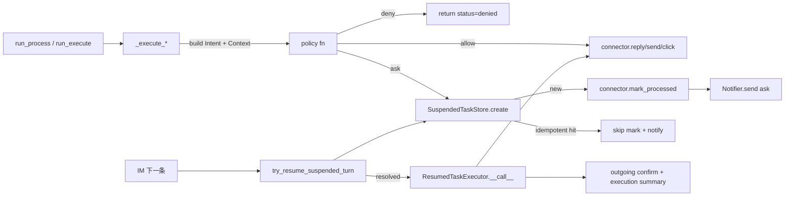

# ADR-006-v2: SafetyPlane — 授权边界与升级原语

| 字段 | 值 |
|---|---|
| 状态 | Accepted |
| 日期 | 2026-04-24(初稿);同日补 §5.6 Resume→Re-execute、§5.7 工作时间北京时区、§5.8 Ask 通知去重 |
| 作用域 | `src/pulse/core/safety/`、`src/pulse/modules/job/chat/`、`src/pulse/core/server.py`、`src/pulse/core/module.py`、`src/pulse/core/config.py`、`src/pulse/core/runtime.py`、`src/pulse/core/scheduler/windows.py`、`src/pulse/modules/job/config.py`、`tests/pulse/core/safety/`、`tests/pulse/modules/job/chat/`、`tests/pulse/core/scheduler/` |
| 关联 | `ADR-001-ToolUseContract.md`、`ADR-003-ActionReport.md`、`ADR-005-Observability.md`、`docs/code-review-checklist.md`;取代 `ADR-006-SafetyPlane.md` |

---

## 1. 现状

SafetyPlane 在 Service 层 side-effect 入口执行授权判决:`JobChatService` 的 `_execute_reply` / `_execute_send_resume` / `_execute_card` 三个方法在调 connector 之前各自运行一条 Python policy 函数(`reply_policy` / `send_resume_policy` / `card_policy`),返回 `Allow` / `Deny` / `Ask` 三值 `Decision`。

`Ask` 分支调 `WorkspaceSuspendedTaskStore.create` 把任务挂起(写入 `WorkspaceMemory.workspace_facts`,key 前缀 `safety.suspended.`);若幂等键命中既有 `awaiting_user` 任务则直接返回该任务、**跳过** `mark_processed` 与 `Notifier.send`(去重见 §5.8);新任务则调 connector 的 `mark_processed` 从平台未读列表踢出这条对话,再通过 `Notifier` 把 Ask 文本推给用户。

用户下一条 IM 文本被 `_dispatch_channel_message` 前置函数 `try_resume_suspended_turn` 截获:resolve 归档后**立即**回调业务模块经由 `BaseModule.get_resumed_task_executor` 注册的 `ResumedTaskExecutor`,把原 Intent 就地重跑到 connector(即 Resume → Re-execute,见 §5.6);执行结果与确认消息合并回给用户,无需等待下一轮 patrol。



## 2. 分层职责

| 层 | 负责 | 不负责 |
|---|---|---|
| `safety.policies` (纯函数) | Deny/Ask/Allow 判决、reason、rule_id、AskRequest 组装 | 持久化、外发、Intent 构造 |
| `safety.suspended` (`WorkspaceSuspendedTaskStore`) | SuspendedTask 生命周期、事件 publish、facts 读写、`(workspace_id, module, trace_id, intent_name)` 幂等去重 | 判决、IM 外发、重放 |
| `safety.resume` (入站 helper) | 解释用户答复 → `ResumeOutcome`、render_ask_for_im、调度 `ResumedTaskExecutor` | 判决、挂起、connector 直接调用 |
| `ResumedTaskExecutor` (业务模块实现) | 重跑原 Intent 对应的 connector 动作、`mark_processed(resume-*)` 审计、返回 `ResumedExecution` | Ask/Deny 判决(用户确认即显式授权,跳过 policy) |
| `JobChatService._execute_*` | 构造 `Intent` + `PermissionContext`、消费 `Decision`、mark_processed、Notifier 外发、幂等短路 | 自行重判 Allow/Deny/Ask |
| `JobChatService.resumed_task_executor` | 分类用户答复(approve/decline/unknown)、分发到 `_resume_reply` / `_resume_send_resume` / `_resume_card` | 判决、持久化 SuspendedTask |
| `server._dispatch_channel_message` | 入站前置 `try_resume_suspended_turn`、收集并传入 `safety_resumed_executors`、常规 Brain 分发 | 授权判决、Ask 渲染 |
| `scheduler.windows` (`is_active_hour` / `is_peak_hour`) | 以 `Asia/Shanghai` 为基准判断工作时间,屏蔽 VPN/系统时区漂移 | 业务动作触发 |
| Brain | 纯 ReAct + 工具调度 | 授权判决(v1 错误地把闸门放在此处,v2 撤销) |

## 3. 第一性原理分析

| 维度 | 分析 | 结论 |
|---|---|---|
| 副作用面 | 产生外部可感知效果的代码路径只有 3 条:回 HR、发简历、点卡片 | 闸门放在这 3 条入口即穷举覆盖,不需要全局 hook |
| 触发路径 | Side-effect 由 patrol(`run_process`)与 interactive(`run_execute`)两路触发,Brain 只在 interactive 路径出现 | 闸门不能挂在 Brain,否则 patrol 全部绕过 |
| 规则规模 | 单用户自部署,policy 规则目前 3 条、可预见 6–10 条,复杂度不大且需要 typing 保护 | 用 Python 函数承载,不引入 YAML DSL;每条规则可 code review、可 IDE 跳转 |
| LLM 参与 | LLM 擅长结构化抽取与风险分类,但不能作为最终放行者(对抗性 prompt 会绕过) | LLM 当 Advisor:产出 `{risk, labels}`;policy 函数作 Judge:读取 advisor 输出 + 用户本会话授权做最终决策 |
| 故障模式 | policy 异常不能把业务流拖挂 | 三条 policy 永不抛异常;service 层 `_run_policy` 兜底 `except → None`,等同 Allow 并 warn log,审计可查 |
| 幂等性 | patrol 周期性重入,SuspendedTask 在 awaiting 期间必须唯一 | `(workspace_id, module, trace_id, intent_name)` 复合键;二次 `create` 返回既有任务,不重复骚扰用户 |
| Ask 出站通道 | patrol 路径无 IncomingMessage 上下文,拿不到 channel/user | 通过 `Notifier`(Feishu/企业微信 webhook)做"后台叫醒用户"唯一通道,而非 channel adapter |
| 可逆性 | 未来若引入多租户 / 多 workspace,需要按用户分组挂起任务 | `safety_workspace_id` 以单常量形式暴露在 `Settings`,替换为 per-user 查表即完成迁移,policy 与 store 契约不变 |

## 4. 运行档位

仅两档,由 `PULSE_SAFETY_PLANE` 控制:

| 值 | 行为 | 适用场景 |
|---|---|---|
| `enforce` | Service 层真跑 policy,Ask/Deny 真阻断;**默认** | 生产 |
| `off` | Service 层跳过 policy,直接调 connector | 本地最小复现、灰度回滚 |

旧 v1 的 `shadow` 档不再保留;`_validate_safety_plane` 字段校验器把 `shadow` 自动升级为 `enforce` 并发 `DeprecationWarning`,避免已部署用户手动迁移。

## 5. 契约

### 5.1 `Intent`

```text
Intent(kind, name, args)
  kind ∈ {"tool_call", "mutation", "reply"}    # 历史枚举, v2 实际只用 "mutation"
  name: "<module>.<action>"                     # e.g. "job.chat.reply"
  args: Mapping[str, Any]                       # 只读语义快照
```

不变式:
- Intent 一经构造即不可变;policy 多次读取同一字段得相同值。
- Intent 不携带调用方身份,身份在 `PermissionContext`。

### 5.2 `PermissionContext`

```text
PermissionContext(module, task_id, trace_id, user_id, profile_view, session_approvals)
  module / task_id / trace_id: 非空 str
  user_id: Optional[str]
  profile_view: Mapping[str, Any]       # 只含 evidence_keys 声明过的字段
  session_approvals: frozenset[str]     # 用户本会话显式放过的 token
```

不变式:
- frozen dataclass,`profile_view` 以 `MappingProxyType` 包装,外部写不回。
- `with_session_approval(token)` 返回新 Context,不修改原对象。

### 5.3 `Decision`

```text
Decision(kind, rule_id?, reason, deny_code?, ask_request?)
  kind ∈ {"allow", "deny", "ask"}
  ask_request 仅在 kind=="ask" 时非空
  deny_code 仅在 kind=="deny" 时非空
```

policy 签名:

```text
policy_fn(intent: Intent, ctx: PermissionContext) -> Decision
```

不变式:
- 纯函数,无 I/O、无 LLM 调用、无副作用。
- 永不抛异常;内部断言失败也要包装成 `Decision.ask`。

### 5.4 `AskRequest` / `ResumeHandle`

```text
AskRequest(question, draft?, context, resume_handle, timeout_seconds)
ResumeHandle(task_id, module, intent_name, payload_schema)
```

`payload_schema` 固定为 `"safety.v1.user_answer"`;Resume 端对不上 schema 直接拒绝并回"以纯文本再说一次"。

### 5.5 `SuspendedTaskStore` 幂等键

```text
awaiting_key = (workspace_id, module, trace_id, intent_name)
```

二次 `create` 命中既有 `awaiting_user` 任务时返回该任务,不新增、不重发 Ask。调用方通过比较返回值的 `task_id` 与自己新生成的 `task_id` 判定是否命中幂等分支,并据此跳过 `mark_processed` 与 `Notifier.send`(见 §5.8)。

### 5.6 Resume → Re-execute(`ResumedTaskExecutor`)

用户确认 Ask 之后,必须在同一回合把原 Intent 推给 connector,否则 `mark_processed` 已经把这条 HR 对话踢出未读列表,下一轮 patrol 不会再看见它,回复永远发不出去。这条 landmine 由 v2 通过一个受限的"确认即重跑"回调消解。

契约:

```text
ResumedTaskExecutor = Callable[[*, task: SuspendedTask, user_answer: str], ResumedExecution]
ResumedExecution(status, ok, summary, detail)
  status ∈ {"executed", "declined", "undetermined", "executor_missing", "failed"}
  ok: bool
  summary: str              # 面向用户的一句话结果
  detail: Optional[Mapping] # 审计明细, 不外发
```

不变式:

- 同步调用,不 await、不起新线程。
- 永不抛异常;内部失败要 catch 成 `status="failed"`。
- 幂等:基于 `task.original_intent.args` 重建所需上下文,不依赖 service 的瞬时状态。
- 不再跑 policy:用户显式答复即最强授权信号;若要复用 policy,需把用户答复注入 `PermissionContext.session_approvals` 后再打一轮。
- 审计:connector 动作完成后立刻 `mark_processed(run_id="resume-<original_run_id>")`,事件落入 `channel.message.resumed` payload 的 `execution.*`。

注册与分发:

- `BaseModule.get_resumed_task_executor() -> Callable | None` 默认 `None`。
- 业务模块(如 `JobChatModule`)覆写该方法,返回绑定到 service 的可调用对象。
- `server._compose_subsystems` 在模块初始化循环里汇总成 `safety_resumed_executors: dict[module_name, ResumedTaskExecutor]`,传给 `try_resume_suspended_turn(executors=...)`。
- `try_resume_suspended_turn` 在 `resolve` 成功分支按 `task.module` 查表并调用;未命中或异常时降级为 `executor_missing` / `failed`,仍向用户回确认文案,不影响会话继续。

用户答复分类(`_classify_user_answer`):

- 近似匹配小写化后的字面 token,无正则、无 LLM。
- `{"ok","好","可以","同意","同意发","发","确认","continue","yes","y","go","send","approve"}` → `approve`。
- `{"不","不可以","拒绝","取消","别发","停","no","n","stop","cancel","decline","reject"}` → `decline`。
- 其他 → `unknown`,保守当作 `declined` 处理(不发送),并把原草稿回显给用户让他"用原话再说一次"。

### 5.7 工作时间窗口(北京时区硬编码)

`is_active_hour` / `is_peak_hour` / `is_weekend` 接受的 `datetime` **必须** 是 aware,一律先 `astimezone(ZoneInfo("Asia/Shanghai"))` 再读 `hour` / `weekday`。

不变式:

- 不从 `datetime.now()` 派生判断,调用方自行提供 `now`,方便测试与 VPN/系统时区漂移场景下的可复现。
- naive datetime 直接 `raise ValueError`;patrol / scheduler 层必须传 UTC aware 或直接传 Beijing aware。
- 默认活跃时段由 `GuardConfig` 读 env:`GUARD_ACTIVE_START_HOUR=9` / `GUARD_ACTIVE_END_HOUR=18` / `GUARD_WEEKEND_START_HOUR=0` / `GUARD_WEEKEND_END_HOUR=0`(周末零窗口,等同整日非活跃)。`is_peak_hour` 由调用方自带 `peak_windows`,不走 env。
- patrol 调度节拍由 `src/pulse/modules/job/config.py::SchedulerConfig` 控制:`patrol_chat_interval_peak=patrol_chat_interval_offpeak=300`(聊天轮询 5 分钟一次);`patrol_greet_interval_peak=900` / `patrol_greet_interval_offpeak=1800`(招呼扫描 15/30 分钟)。非工作时段 `SchedulerEngine` 不触发 patrol,自然跳过 SafetyPlane 闸门。

### 5.8 Ask 通知去重

幂等命中场景(`SuspendedTaskStore.create` 返回既有 `awaiting_user` 任务)不得重复外发 Ask。`JobChatService._suspend_and_mark` 的短路协议:

```text
new_task_id = uuid4()
stored = store.create(task_id=new_task_id, ...)
if stored.task_id != new_task_id:
    # 幂等命中: 已有人在等用户回复
    log("safety.suspend.idempotent_skip")
    return SafetyMeta(idempotent=True, ...)   # 不调 mark_processed, 不调 Notifier.send
# 新任务: 正常踢出未读 + 推 Ask
connector.mark_processed(...)
notifier.send(ask_text)
```

不变式:

- 去重粒度与 store 的幂等键一致,即一条 `(workspace_id, module, trace_id, intent_name)` 在 `awaiting_user` 期间最多一条 Ask 外发。
- 返回给 patrol 的 `safety` meta 包含 `idempotent: bool`,便于上游审计/Runtime 快照。
- TTL 到期或用户答复后,幂等键随 `resolve` / `archive` 释放,下一次 Ask 允许重新发送。

## 6. 事件

| 事件名 | 触发点 | 关键 payload |
|---|---|---|
| `task.suspended` | `WorkspaceSuspendedTaskStore.create` 成功(新任务) | `task_id`, `module`, `intent_name`, `rule_id` |
| `task.resumed` | `WorkspaceSuspendedTaskStore.resolve` 成功 | `task_id`, `resolution_kind`(confirm/reject) |
| `task.denied` | policy 返 deny 或 resume reject | `task_id`, `rule_id`, `deny_code` |
| `task.ask_timeout` | TTL 到期 | `task_id`, `timeout_seconds` |
| `channel.message.resumed` | `server._dispatch_channel_message` 出站 | `resolution_kind`, `execution.status`, `execution.ok`, `execution.summary` |

事件名在 `pulse.core.safety.suspended` 以常量形式暴露(`EVENT_TASK_SUSPENDED` 等),由 `JsonlEventSink` 统一落盘。幂等命中(§5.8)不额外发事件、仅 `log.info("safety.ask.idempotent_skip ...")`,因为"被去重的 Ask"与"从未发出的 Ask"审计语义一致。`ResumedTaskExecutor` 的返回值(`execution.status` / `execution.ok` / `execution.summary`)通过 `channel.message.resumed` 事件携带,不单独定义 `task.reexecuted` 事件——执行结果与用户可见的确认回执天然同一事件。

## 7. 可逆性

替换触发条件(任一命中即重开评估):

1. policy 条目数 > 20,或出现跨 module 规则复用需求;改为 policy 注册表 + 声明式 DSL。
2. 多用户多 workspace 落地;`safety_workspace_id` 升级为 `workspace_id_provider: Callable[[TaskContext], str]`。
3. Ask 出站需要按 channel 差异化(飞书卡片按钮 vs 企微文本);`render_ask_for_im` 按 `channel` 分支扩展即可,不改 policy 与 store。

## 8. 附录:移除的 v1 构件

(仅列接口变化,实现细节见 git log)

- `PermissionGate` / `WorkspacePermissionGate` 协议 — 由三条 policy 函数取代
- `RuleEngine` / YAML 规则 — 由 Python policy 函数取代
- `ActionResolver` / `StaticActionResolver` — Service 层直接构造 Intent,不再反向解析 tool_call
- `before_tool_use` hook 中 safety 分支(`build_safety_before_tool`) — 闸门下沉到 Service 层
- `BrainStep.decision` 字段、`StopReason.tool_denied` / `StopReason.tool_suspended` — Brain 不再参与授权
- `PULSE_SAFETY_PLANE=shadow` — 自动升级为 `enforce`

## 9. 附录:落地补丁(与 §5.6 / §5.7 / §5.8 对齐)

同日合入的三项修复,覆盖"确认即重跑 / 时区 / 通知去重"三个 v2 初稿遗漏的 landmine。代码真理源见括号里的文件。

| 主题 | 影响面 | 关键变更 |
|---|---|---|
| Resume → Re-execute | `src/pulse/core/safety/resume.py`、`src/pulse/core/module.py`、`src/pulse/modules/job/chat/{service,module}.py`、`src/pulse/core/server.py` | 新增 `ResumedTaskExecutor` Protocol、`ResumedExecution` dataclass;`ResumeOutcome.execution` 携带结果;server 汇总 executors 并注入;`JobChatService.resumed_task_executor` 按 intent 分发到 `_resume_reply` / `_resume_send_resume` / `_resume_card`,内部直接调 connector 并 `mark_processed(run_id="resume-*")`;`Intent.args` 扩展 `profile_id` / `conversation_hint` / `card_id` / `card_action` 保证重跑自包含;`_classify_user_answer` 提供 approve/decline/unknown 三值映射。 |
| 工作时间北京时区 | `src/pulse/core/scheduler/windows.py`、`tests/pulse/core/scheduler/test_windows.py` | 新增模块常量 `_BEIJING_TZ = ZoneInfo("Asia/Shanghai")` 与 `_as_beijing`;`is_weekend` / `is_active_hour` / `is_peak_hour` 统一先转北京时区再读 `hour` / `weekday`;naive datetime 直接 `raise ValueError`;测试全部切到 aware UTC 输入,并增加"naive 抛错"专项用例。 |
| Ask 通知去重 | `src/pulse/modules/job/chat/service.py`、`tests/pulse/modules/job/chat/test_service_safety.py` | `_suspend_and_mark` 先生成新 `task_id`,再 `store.create`;返回 `task_id` 与新生成 ID 不一致则视为幂等命中、跳过 `mark_processed` + `Notifier.send`,并在 safety meta 打上 `idempotent=True`;对应用例覆盖二次 patrol 不发 Ask。 |

触发窗口(真理源见代码):

- 聊天 patrol 节拍:`SchedulerConfig.patrol_chat_interval_{peak,offpeak}=300` 秒(5 分钟)。
- 活跃时段:`GUARD_ACTIVE_START_HOUR=9` / `GUARD_ACTIVE_END_HOUR=18`;周末 env 默认为零窗口,等同工作日 9-18 北京时间。
- 时区基准始终为 `Asia/Shanghai`,不受用户系统时区 / VPN 影响。
